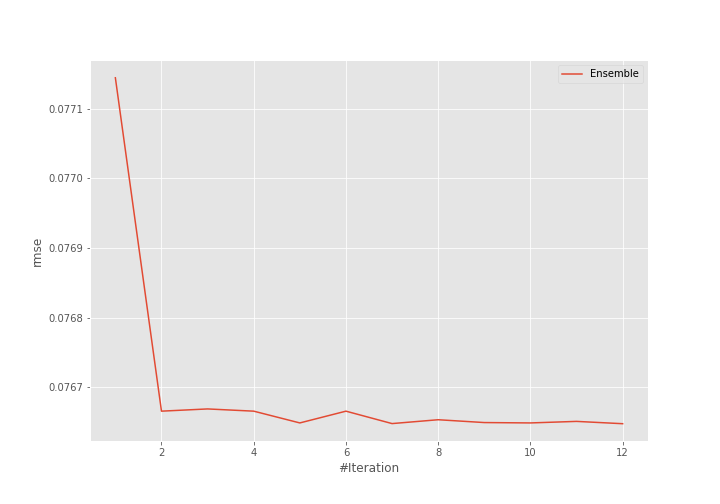
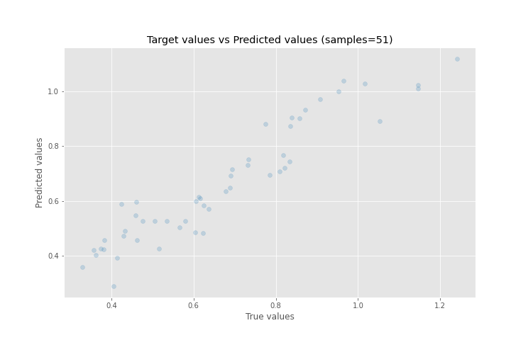
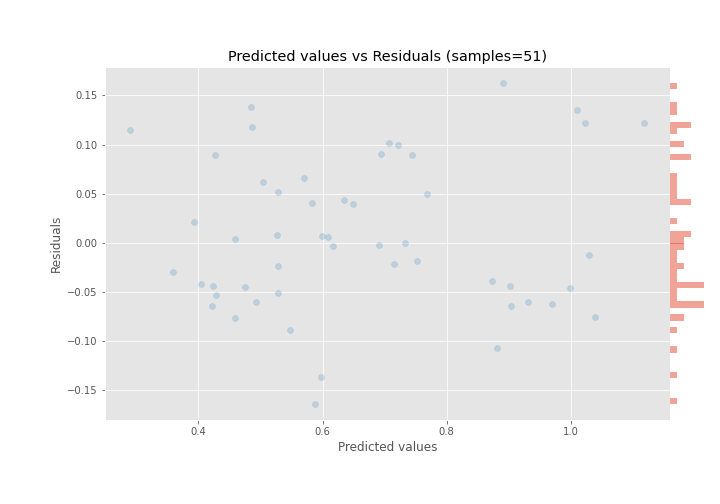

# Summary of Ensemble

[<< Go back](../README.md)

## Ensemble structure
| Model       |   Weight |
|:------------|---------:|
| 15_LightGBM |        7 |
| 36_LightGBM |        5 |

### Metric details:
| Metric   |      Score |
|:---------|-----------:|
| MAE      | 0.0631117  |
| MSE      | 0.00587488 |
| RMSE     | 0.0766477  |
| R2       | 0.888018   |
| MAPE     | 0.102763   |

## Learning curves

## True vs Predicted

## Predicted vs Residuals

[<< Go back](../README.md)
