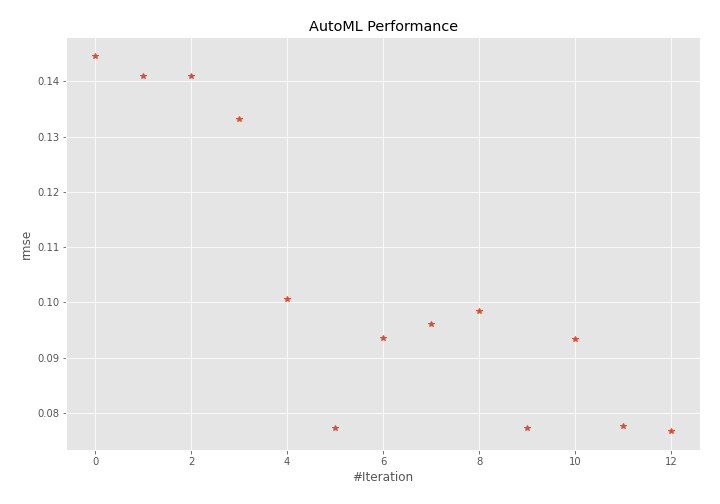
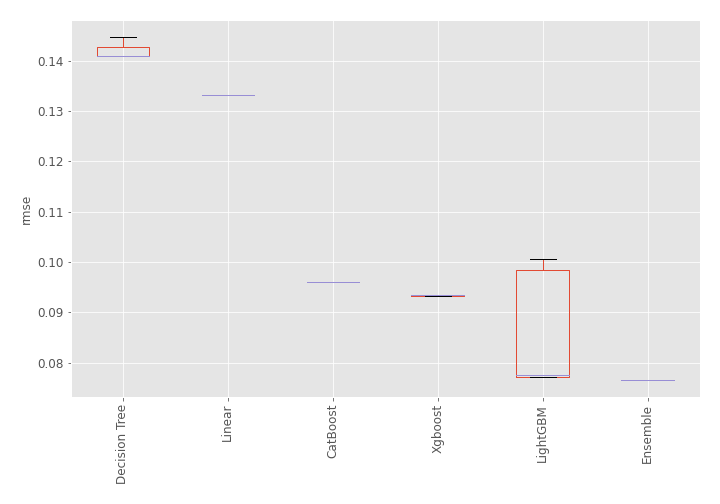
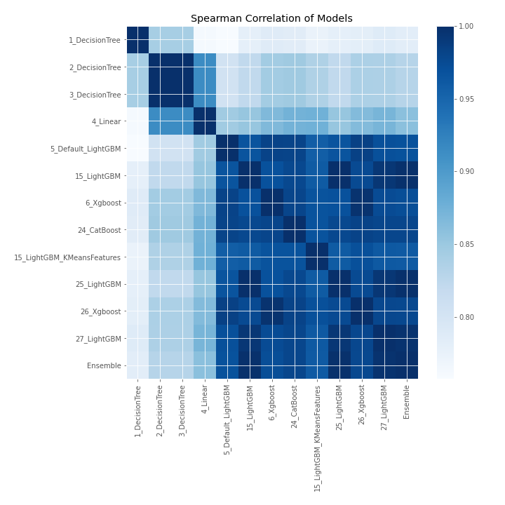

# AutoML Leaderboard

| Best model   | name                                                               | model_type    | metric_type   |   metric_value |   train_time |
|:-------------|:-------------------------------------------------------------------|:--------------|:--------------|---------------:|-------------:|
|              | [1_DecisionTree](1_DecisionTree/README.md)                         | Decision Tree | rmse          |      0.144646  |         0.51 |
|              | [2_DecisionTree](2_DecisionTree/README.md)                         | Decision Tree | rmse          |      0.140926  |         0.45 |
|              | [3_DecisionTree](3_DecisionTree/README.md)                         | Decision Tree | rmse          |      0.140926  |         0.44 |
|              | [4_Linear](4_Linear/README.md)                                     | Linear        | rmse          |      0.133148  |         0.48 |
|              | [5_Default_LightGBM](5_Default_LightGBM/README.md)                 | LightGBM      | rmse          |      0.100574  |         0.67 |
|              | [15_LightGBM](15_LightGBM/README.md)                               | LightGBM      | rmse          |      0.0771442 |         0.69 |
|              | [6_Xgboost](6_Xgboost/README.md)                                   | Xgboost       | rmse          |      0.0934645 |         0.71 |
|              | [24_CatBoost](24_CatBoost/README.md)                               | CatBoost      | rmse          |      0.0960116 |         1.08 |
|              | [15_LightGBM_KMeansFeatures](15_LightGBM_KMeansFeatures/README.md) | LightGBM      | rmse          |      0.0984439 |         0.93 |
|              | [25_LightGBM](25_LightGBM/README.md)                               | LightGBM      | rmse          |      0.0771442 |         0.71 |
|              | [26_Xgboost](26_Xgboost/README.md)                                 | Xgboost       | rmse          |      0.0932867 |         0.68 |
|              | [27_LightGBM](27_LightGBM/README.md)                               | LightGBM      | rmse          |      0.0775913 |         0.66 |
| **the best** | [Ensemble](Ensemble/README.md)                                     | Ensemble      | rmse          |      0.0766477 |         0.32 |

### AutoML Performance

### AutoML Performance Boxplot

### Spearman Correlation of Models

