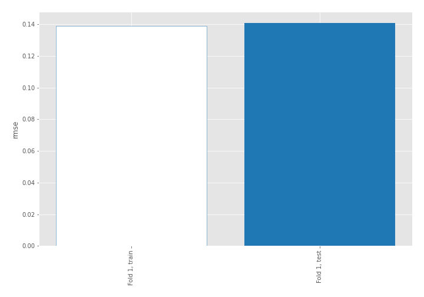
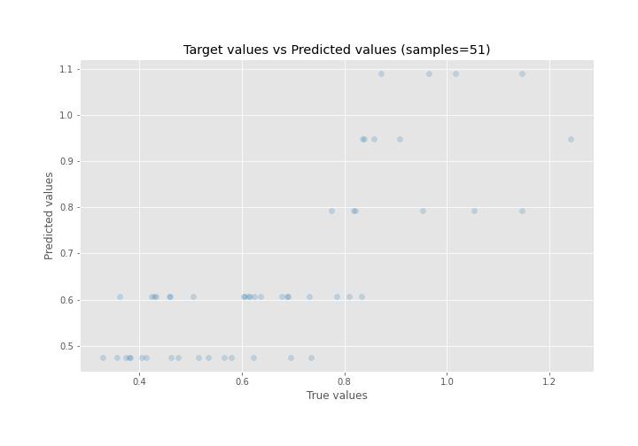
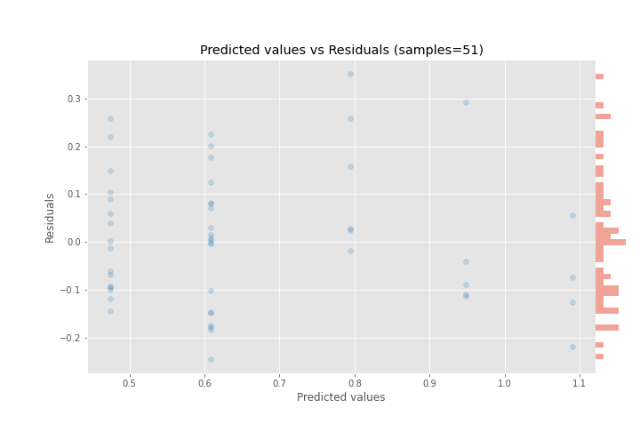

# Summary of 3_DecisionTree

[<< Go back](../README.md)

## Decision Tree
- **n_jobs**: -1
- **criterion**: mse
- **max_depth**: 4
- **explain_level**: 0

## Validation
 - **validation_type**: split
 - **train_ratio**: 0.9
 - **shuffle**: True

## Optimized metric
rmse

## Training time

0.4 seconds

### Metric details:
| Metric   |     Score |
|:---------|----------:|
| MAE      | 0.113513  |
| MSE      | 0.0198602 |
| RMSE     | 0.140926  |
| R2       | 0.621443  |
| MAPE     | 0.184685  |

## Learning curves

## True vs Predicted

## Predicted vs Residuals

[<< Go back](../README.md)
