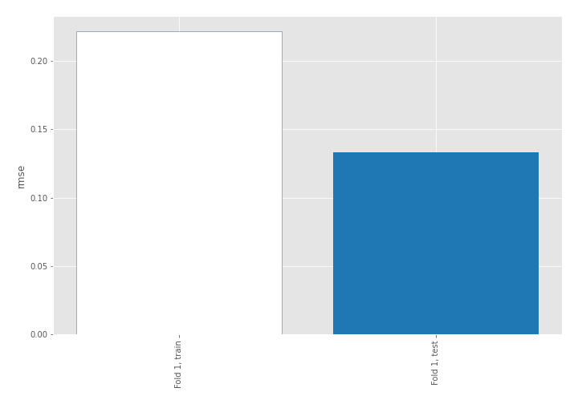
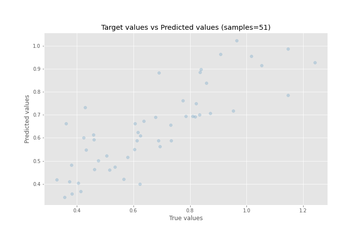
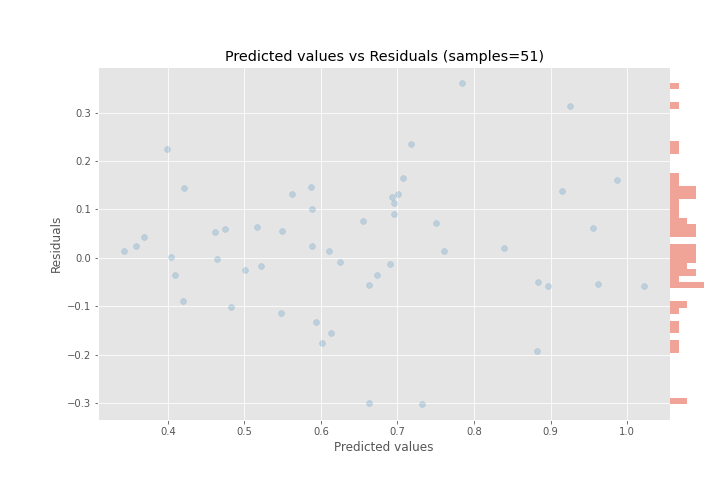

# Summary of 4_Linear

[<< Go back](../README.md)

## Linear Regression (Linear)
- **n_jobs**: -1
- **explain_level**: 0

## Validation
 - **validation_type**: split
 - **train_ratio**: 0.9
 - **shuffle**: True

## Optimized metric
rmse

## Training time

0.5 seconds

### Metric details:
| Metric   |     Score |
|:---------|----------:|
| MAE      | 0.101094  |
| MSE      | 0.0177283 |
| RMSE     | 0.133148  |
| R2       | 0.66208   |
| MAPE     | 0.161768  |

## Learning curves

## True vs Predicted

## Predicted vs Residuals

[<< Go back](../README.md)
