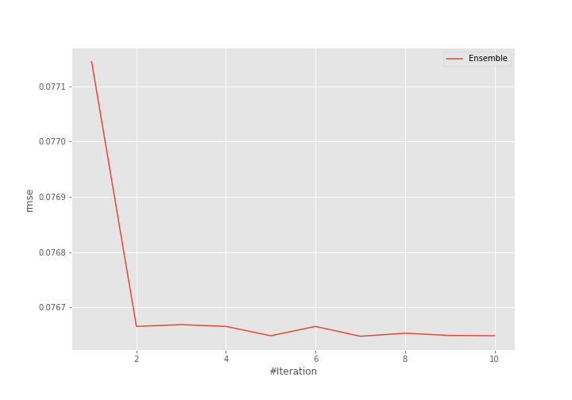
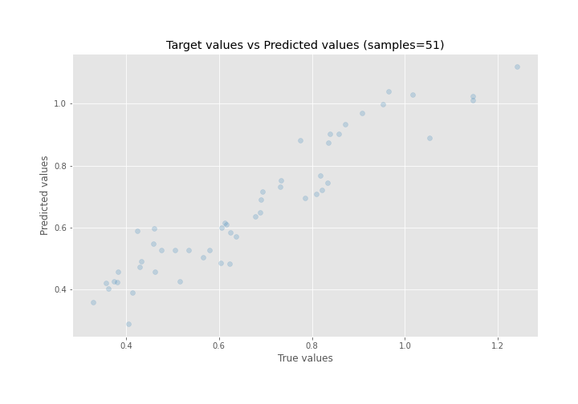
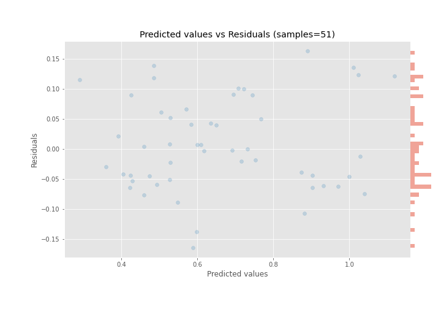

# Summary of Ensemble

[<< Go back](../README.md)

## Ensemble structure
| Model       |   Weight |
|:------------|---------:|
| 14_LightGBM |        4 |
| 24_LightGBM |        3 |

### Metric details:
| Metric   |     Score |
|:---------|----------:|
| MAE      | 0.0631051 |
| MSE      | 0.0058749 |
| RMSE     | 0.0766479 |
| R2       | 0.888018  |
| MAPE     | 0.10278   |

## Learning curves

## True vs Predicted

## Predicted vs Residuals

[<< Go back](../README.md)
