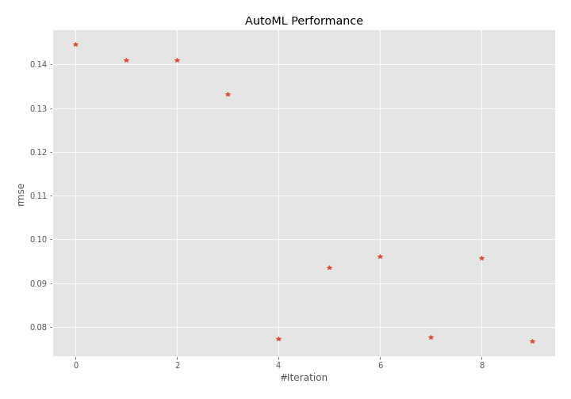
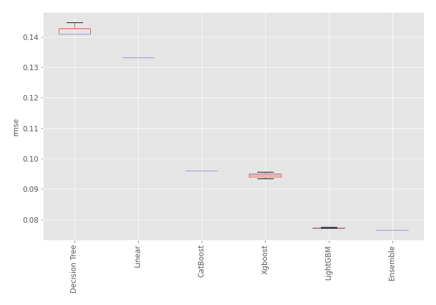
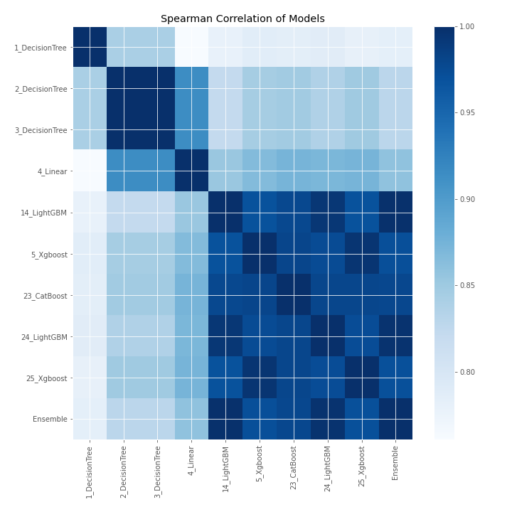

# AutoML Leaderboard

| Best model   | name                                       | model_type    | metric_type   |   metric_value |   train_time |
|:-------------|:-------------------------------------------|:--------------|:--------------|---------------:|-------------:|
|              | [1_DecisionTree](1_DecisionTree/README.md) | Decision Tree | rmse          |      0.144646  |         0.81 |
|              | [2_DecisionTree](2_DecisionTree/README.md) | Decision Tree | rmse          |      0.140926  |         0.7  |
|              | [3_DecisionTree](3_DecisionTree/README.md) | Decision Tree | rmse          |      0.140926  |         0.71 |
|              | [4_Linear](4_Linear/README.md)             | Linear        | rmse          |      0.133148  |         0.74 |
|              | [14_LightGBM](14_LightGBM/README.md)       | LightGBM      | rmse          |      0.0771442 |         1.03 |
|              | [5_Xgboost](5_Xgboost/README.md)           | Xgboost       | rmse          |      0.0934645 |         0.92 |
|              | [23_CatBoost](23_CatBoost/README.md)       | CatBoost      | rmse          |      0.0960116 |         1.35 |
|              | [24_LightGBM](24_LightGBM/README.md)       | LightGBM      | rmse          |      0.0775913 |         0.85 |
|              | [25_Xgboost](25_Xgboost/README.md)         | Xgboost       | rmse          |      0.0957156 |         1.02 |
| **the best** | [Ensemble](Ensemble/README.md)             | Ensemble      | rmse          |      0.0766479 |         0.23 |

### AutoML Performance

### AutoML Performance Boxplot

### Spearman Correlation of Models

