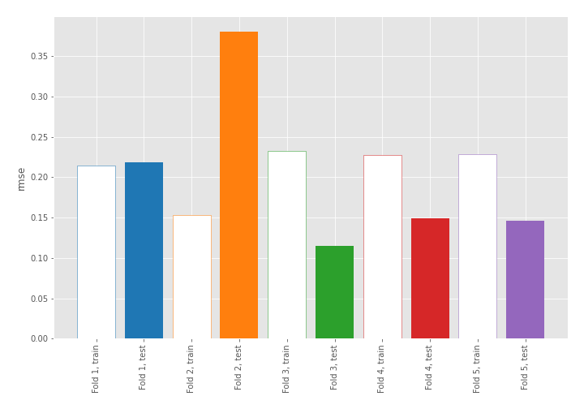
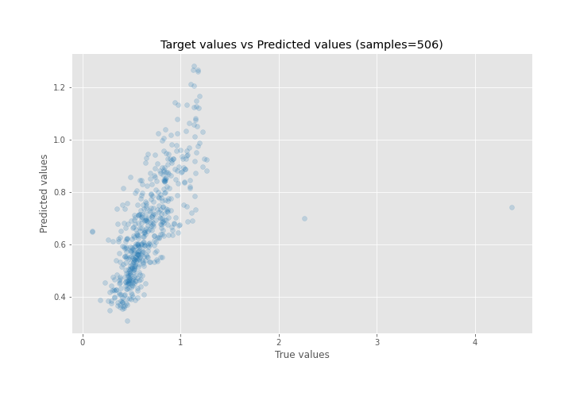
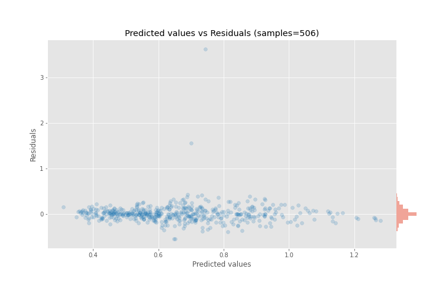

# Summary of 1_Linear

[<< Go back](../README.md)

## Linear Regression (Linear)
- **n_jobs**: -1
- **explain_level**: 1

## Validation
 - **validation_type**: kfold
 - **k_folds**: 5
 - **shuffle**: True

## Optimized metric
rmse

## Training time

36.6 seconds

### Metric details:
| Metric   |    Score |
|:---------|---------:|
| MAE      | 0.112703 |
| MSE      | 0.049751 |
| RMSE     | 0.223049 |
| R2       | 0.409151 |
| MAPE     | 0.188678 |

## Learning curves

## Coefficients
| feature         |    Learner_1 |    Learner_2 |    Learner_3 |    Learner_4 |    Learner_5 |
|:----------------|-------------:|-------------:|-------------:|-------------:|-------------:|
| Year            |  0.469562    |  0.607063    |  0.531696    |  0.493799    |  0.52738     |
| ALT             |  0.373817    |  0.325468    |  0.348377    |  0.378802    |  0.390477    |
| Wind            |  0.165301    |  0.125558    |  0.135864    |  0.171772    |  0.121198    |
| Min_Temp        |  0.110026    |  0.0234225   |  0.086862    |  0.110795    |  0.123353    |
| Humidity        |  0.108534    |  0.0746563   |  0.0837492   |  0.0814257   |  0.0708132   |
| Max_Temp        |  0.0764578   |  0.0835442   |  0.0599984   |  0.035558    |  0.0730027   |
| Cloud           |  0.0262905   | -0.0148683   |  0.0242609   |  0.0150745   | -0.00410056  |
| Rainfall        | -0.0397346   |  0.0136545   |  0.0284556   | -0.0123859   |  0.044159    |
| intercept       |  3.54424e-15 | -4.87398e-16 |  4.04772e-15 |  1.52504e-15 | -2.31237e-15 |
| Bright Sunshine | -0.0208217   |  0.00173983  |  0.0251571   | -0.0160498   |  0.00968007  |
| Area            | -0.0901365   | -0.0600088   | -0.0709569   | -0.0741326   | -0.0644694   |
| District        | -0.118271    | -0.151615    | -0.139983    | -0.135881    | -0.155895    |

## True vs Predicted

## Predicted vs Residuals

[<< Go back](../README.md)
