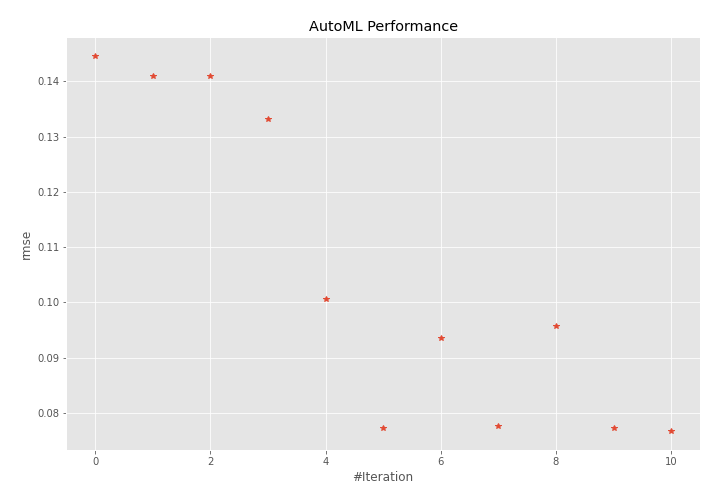
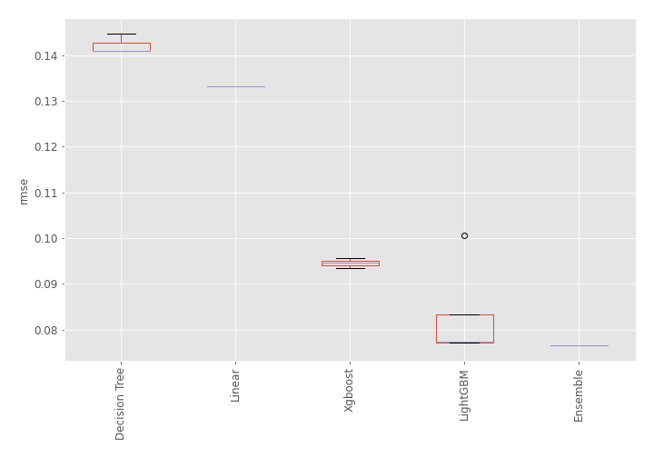
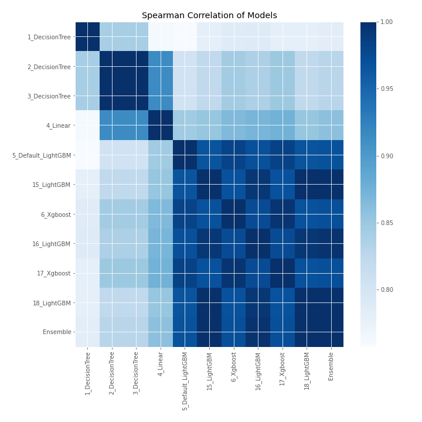

# AutoML Leaderboard

| Best model   | name                                               | model_type    | metric_type   |   metric_value |   train_time |
|:-------------|:---------------------------------------------------|:--------------|:--------------|---------------:|-------------:|
|              | [1_DecisionTree](1_DecisionTree/README.md)         | Decision Tree | rmse          |      0.144646  |         0.39 |
|              | [2_DecisionTree](2_DecisionTree/README.md)         | Decision Tree | rmse          |      0.140926  |         0.42 |
|              | [3_DecisionTree](3_DecisionTree/README.md)         | Decision Tree | rmse          |      0.140926  |         0.41 |
|              | [4_Linear](4_Linear/README.md)                     | Linear        | rmse          |      0.133148  |         0.43 |
|              | [5_Default_LightGBM](5_Default_LightGBM/README.md) | LightGBM      | rmse          |      0.100574  |         0.85 |
|              | [15_LightGBM](15_LightGBM/README.md)               | LightGBM      | rmse          |      0.0771442 |         2.48 |
|              | [6_Xgboost](6_Xgboost/README.md)                   | Xgboost       | rmse          |      0.0934645 |         0.84 |
|              | [16_LightGBM](16_LightGBM/README.md)               | LightGBM      | rmse          |      0.0775913 |         0.58 |
|              | [17_Xgboost](17_Xgboost/README.md)                 | Xgboost       | rmse          |      0.0957156 |         0.71 |
|              | [18_LightGBM](18_LightGBM/README.md)               | LightGBM      | rmse          |      0.0771442 |         0.64 |
| **the best** | [Ensemble](Ensemble/README.md)                     | Ensemble      | rmse          |      0.0766479 |         0.25 |

### AutoML Performance

### AutoML Performance Boxplot

### Spearman Correlation of Models

