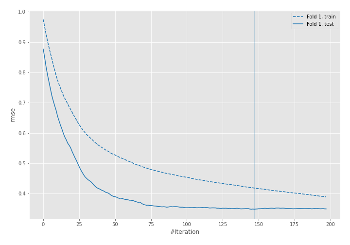
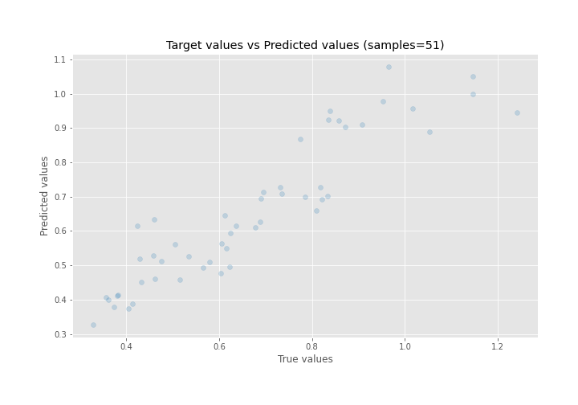
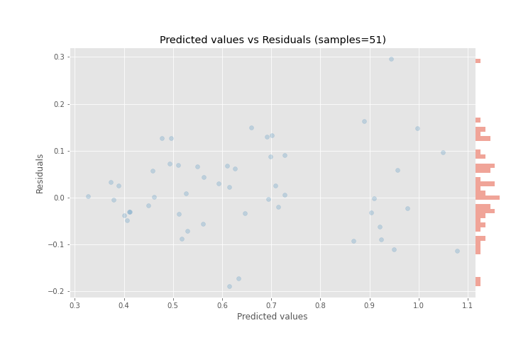

# Summary of 15_LightGBM

[<< Go back](../README.md)

## LightGBM
- **n_jobs**: -1
- **objective**: regression
- **num_leaves**: 15
- **learning_rate**: 0.05
- **feature_fraction**: 0.8
- **bagging_fraction**: 0.5
- **min_data_in_leaf**: 30
- **metric**: rmse
- **custom_eval_metric_name**: None
- **explain_level**: 0

## Validation
 - **validation_type**: split
 - **train_ratio**: 0.9
 - **shuffle**: True

## Optimized metric
rmse

## Training time

2.3 seconds

### Metric details:
| Metric   |      Score |
|:---------|-----------:|
| MAE      | 0.069911   |
| MSE      | 0.00830919 |
| RMSE     | 0.0911548  |
| R2       | 0.841618   |
| MAPE     | 0.104894   |

## Learning curves

## True vs Predicted

## Predicted vs Residuals

[<< Go back](../README.md)
