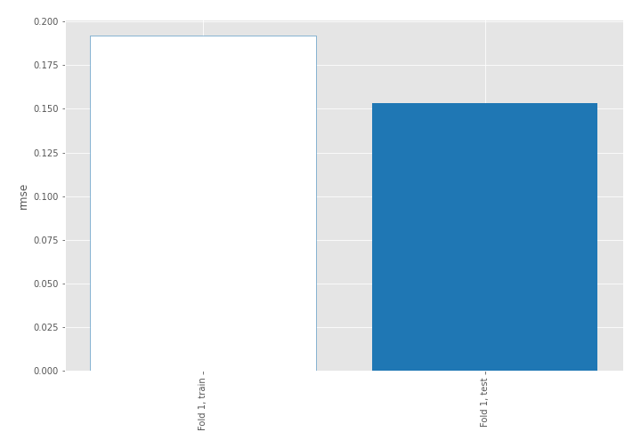
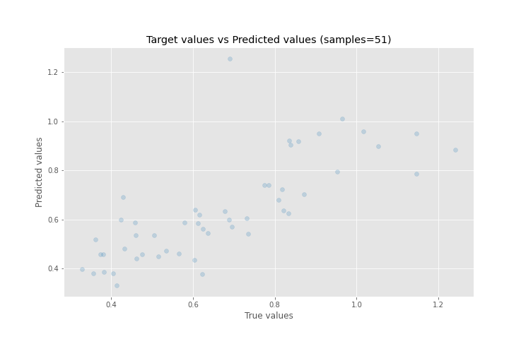
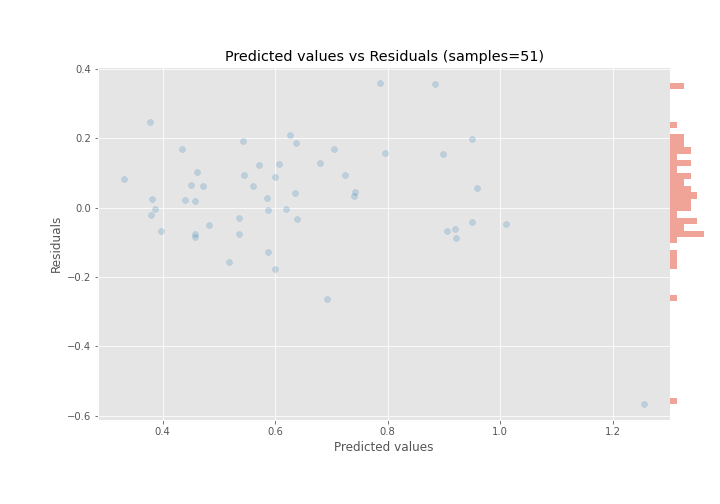

# Summary of 4_Linear_KMeansFeatures

[<< Go back](../README.md)

## Linear Regression (Linear)
- **n_jobs**: -1
- **explain_level**: 0

## Validation
 - **validation_type**: split
 - **train_ratio**: 0.9
 - **shuffle**: True

## Optimized metric
rmse

## Training time

0.6 seconds

### Metric details:
| Metric   |     Score |
|:---------|----------:|
| MAE      | 0.112513  |
| MSE      | 0.0234546 |
| RMSE     | 0.153149  |
| R2       | 0.55293   |
| MAPE     | 0.171398  |

## Learning curves

## True vs Predicted

## Predicted vs Residuals

[<< Go back](../README.md)
