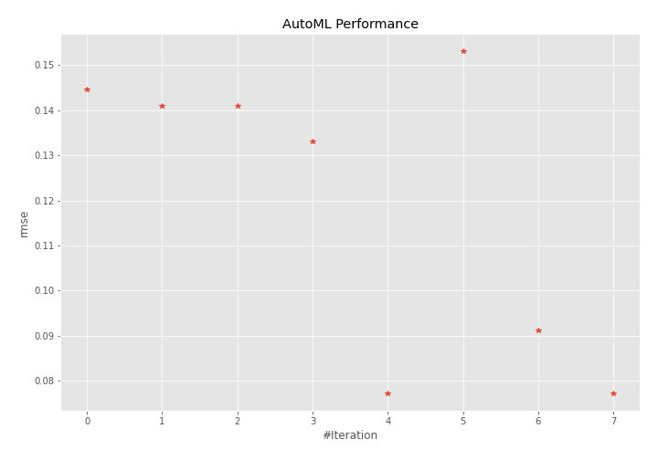
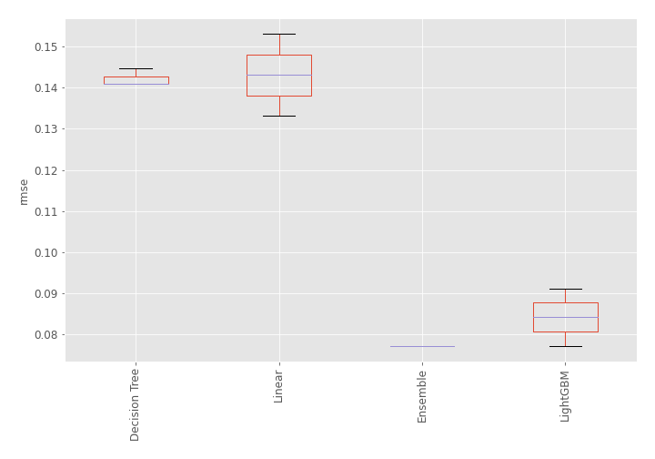
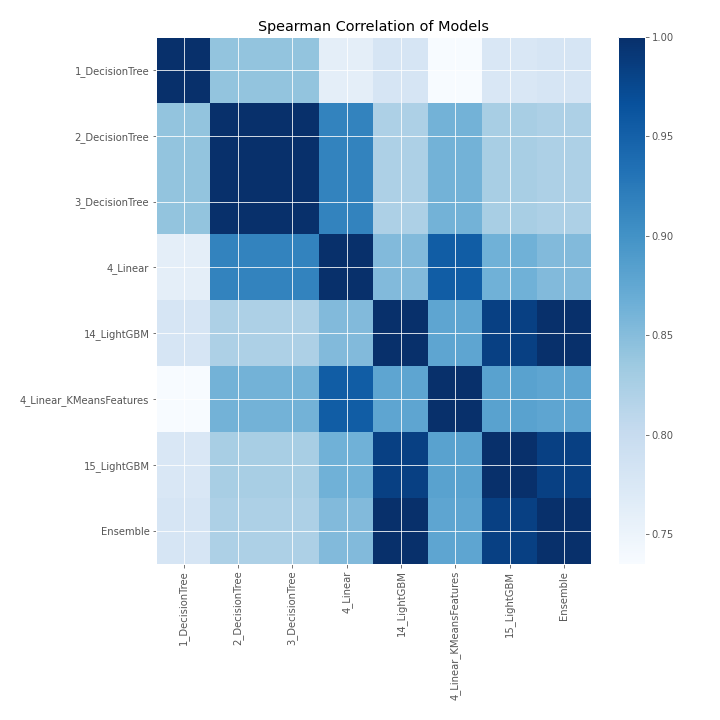

# AutoML Leaderboard

| Best model   | name                                                         | model_type    | metric_type   |   metric_value |   train_time |
|:-------------|:-------------------------------------------------------------|:--------------|:--------------|---------------:|-------------:|
|              | [1_DecisionTree](1_DecisionTree/README.md)                   | Decision Tree | rmse          |      0.144646  |         0.5  |
|              | [2_DecisionTree](2_DecisionTree/README.md)                   | Decision Tree | rmse          |      0.140926  |         0.48 |
|              | [3_DecisionTree](3_DecisionTree/README.md)                   | Decision Tree | rmse          |      0.140926  |         0.55 |
|              | [4_Linear](4_Linear/README.md)                               | Linear        | rmse          |      0.133148  |         0.61 |
| **the best** | [14_LightGBM](14_LightGBM/README.md)                         | LightGBM      | rmse          |      0.0771442 |         3.33 |
|              | [4_Linear_KMeansFeatures](4_Linear_KMeansFeatures/README.md) | Linear        | rmse          |      0.153149  |         0.77 |
|              | [15_LightGBM](15_LightGBM/README.md)                         | LightGBM      | rmse          |      0.0911548 |         2.51 |
|              | [Ensemble](Ensemble/README.md)                               | Ensemble      | rmse          |      0.0771442 |         0.24 |

### AutoML Performance

### AutoML Performance Boxplot

### Spearman Correlation of Models

