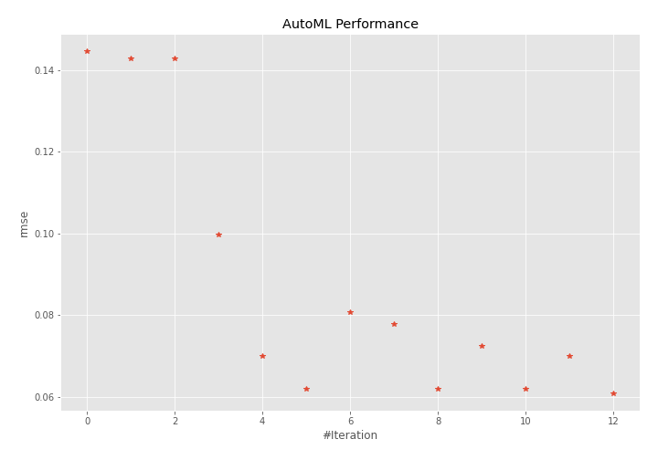
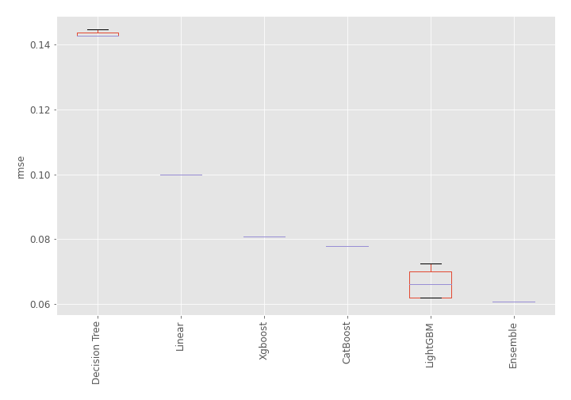
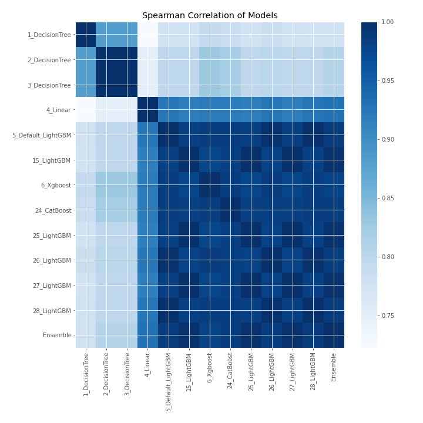

# AutoML Leaderboard

| Best model   | name                                               | model_type    | metric_type   |   metric_value |   train_time |
|:-------------|:---------------------------------------------------|:--------------|:--------------|---------------:|-------------:|
|              | [1_DecisionTree](1_DecisionTree/README.md)         | Decision Tree | rmse          |      0.144646  |         0.38 |
|              | [2_DecisionTree](2_DecisionTree/README.md)         | Decision Tree | rmse          |      0.14271   |         0.38 |
|              | [3_DecisionTree](3_DecisionTree/README.md)         | Decision Tree | rmse          |      0.14271   |         0.4  |
|              | [4_Linear](4_Linear/README.md)                     | Linear        | rmse          |      0.0997829 |         0.43 |
|              | [5_Default_LightGBM](5_Default_LightGBM/README.md) | LightGBM      | rmse          |      0.070047  |         0.67 |
|              | [15_LightGBM](15_LightGBM/README.md)               | LightGBM      | rmse          |      0.0619596 |         0.55 |
|              | [6_Xgboost](6_Xgboost/README.md)                   | Xgboost       | rmse          |      0.0808143 |         0.67 |
|              | [24_CatBoost](24_CatBoost/README.md)               | CatBoost      | rmse          |      0.0777849 |         1.99 |
|              | [25_LightGBM](25_LightGBM/README.md)               | LightGBM      | rmse          |      0.0619596 |         0.61 |
|              | [26_LightGBM](26_LightGBM/README.md)               | LightGBM      | rmse          |      0.0725291 |         0.7  |
|              | [27_LightGBM](27_LightGBM/README.md)               | LightGBM      | rmse          |      0.0619596 |         0.61 |
|              | [28_LightGBM](28_LightGBM/README.md)               | LightGBM      | rmse          |      0.070047  |         0.65 |
| **the best** | [Ensemble](Ensemble/README.md)                     | Ensemble      | rmse          |      0.060779  |         0.34 |

### AutoML Performance

### AutoML Performance Boxplot

### Spearman Correlation of Models

