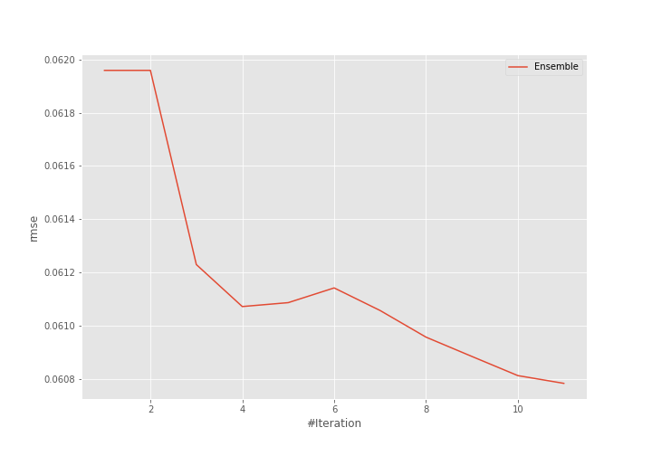
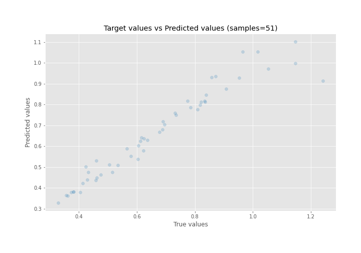
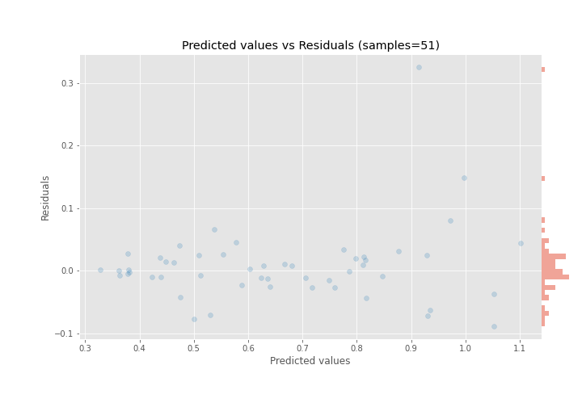

# Summary of Ensemble

[<< Go back](../README.md)

## Ensemble structure
| Model              |   Weight |
|:-------------------|---------:|
| 15_LightGBM        |        8 |
| 4_Linear           |        1 |
| 5_Default_LightGBM |        2 |

### Metric details:
| Metric   |      Score |
|:---------|-----------:|
| MAE      | 0.034629   |
| MSE      | 0.00369454 |
| RMSE     | 0.0607827  |
| R2       | 0.929578   |
| MAPE     | 0.0468127  |

## Learning curves

## True vs Predicted

## Predicted vs Residuals

[<< Go back](../README.md)
