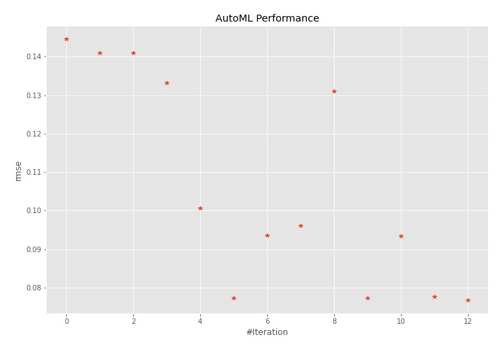
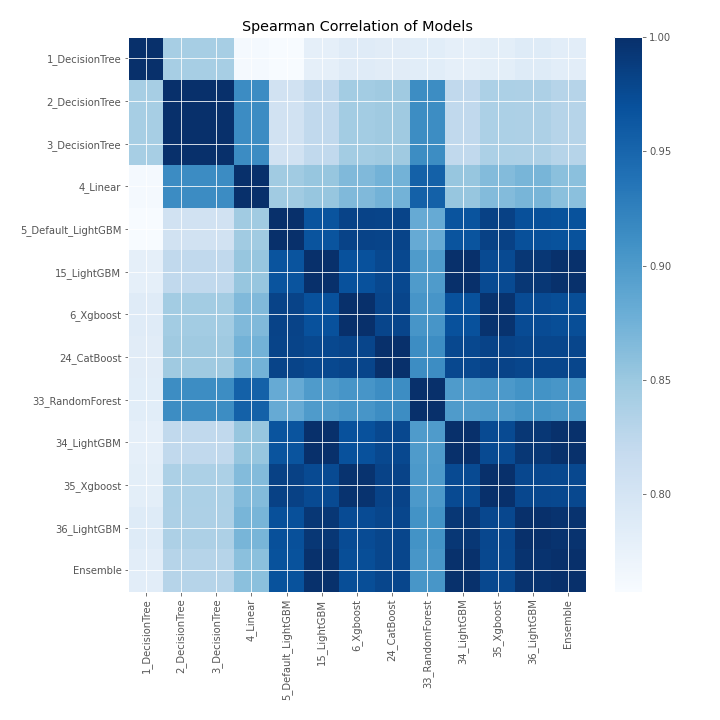

# AutoML Leaderboard

| Best model   | name                                               | model_type    | metric_type   |   metric_value |   train_time |
|:-------------|:---------------------------------------------------|:--------------|:--------------|---------------:|-------------:|
|              | [1_DecisionTree](1_DecisionTree/README.md)         | Decision Tree | rmse          |      0.144646  |         0.45 |
|              | [2_DecisionTree](2_DecisionTree/README.md)         | Decision Tree | rmse          |      0.140926  |         0.42 |
|              | [3_DecisionTree](3_DecisionTree/README.md)         | Decision Tree | rmse          |      0.140926  |         0.42 |
|              | [4_Linear](4_Linear/README.md)                     | Linear        | rmse          |      0.133148  |         0.45 |
|              | [5_Default_LightGBM](5_Default_LightGBM/README.md) | LightGBM      | rmse          |      0.100574  |         0.57 |
|              | [15_LightGBM](15_LightGBM/README.md)               | LightGBM      | rmse          |      0.0771442 |         0.58 |
|              | [6_Xgboost](6_Xgboost/README.md)                   | Xgboost       | rmse          |      0.0934645 |         0.59 |
|              | [24_CatBoost](24_CatBoost/README.md)               | CatBoost      | rmse          |      0.0960116 |         1.15 |
|              | [33_RandomForest](33_RandomForest/README.md)       | Random Forest | rmse          |      0.130981  |         0.99 |
|              | [34_LightGBM](34_LightGBM/README.md)               | LightGBM      | rmse          |      0.0771442 |         0.63 |
|              | [35_Xgboost](35_Xgboost/README.md)                 | Xgboost       | rmse          |      0.0932867 |         0.73 |
|              | [36_LightGBM](36_LightGBM/README.md)               | LightGBM      | rmse          |      0.0775913 |         0.56 |
| **the best** | [Ensemble](Ensemble/README.md)                     | Ensemble      | rmse          |      0.0766477 |         0.32 |

### AutoML Performance

### AutoML Performance Boxplot

### Spearman Correlation of Models

