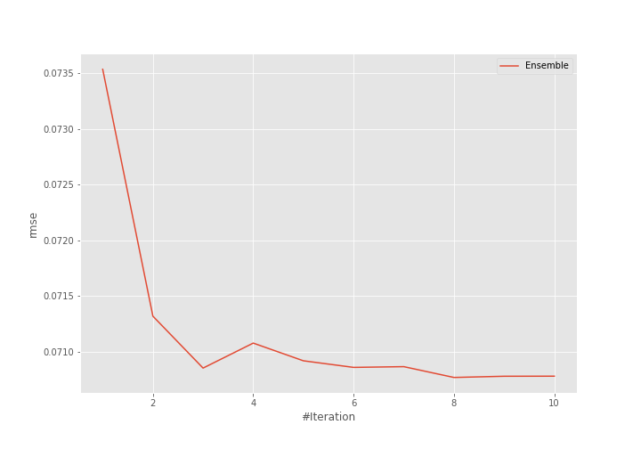
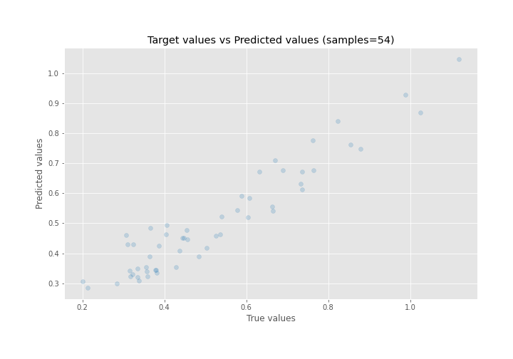
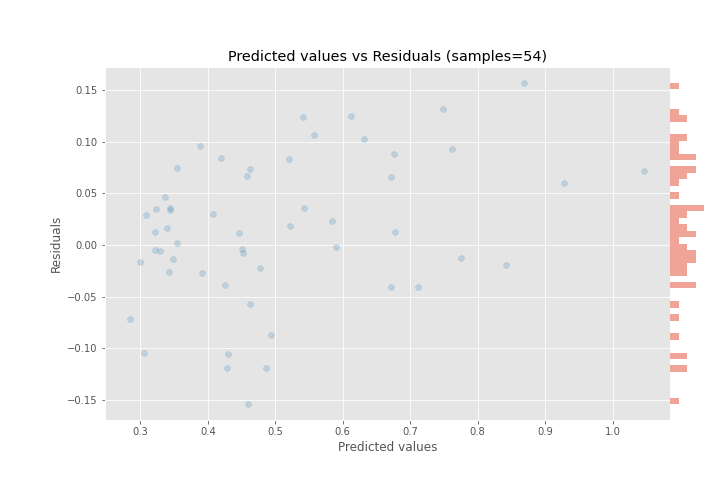

# Summary of Ensemble

[<< Go back](../README.md)

## Ensemble structure
| Model                    |   Weight |
|:-------------------------|---------:|
| 15_LightGBM              |        1 |
| 25_Xgboost               |        1 |
| 5_Default_LightGBM       |        2 |
| 6_Xgboost_KMeansFeatures |        4 |

### Metric details:
| Metric   |      Score |
|:---------|-----------:|
| MAE      | 0.05631    |
| MSE      | 0.00500851 |
| RMSE     | 0.0707708  |
| R2       | 0.88835    |
| MAPE     | 0.121065   |

## Learning curves

## True vs Predicted

## Predicted vs Residuals

[<< Go back](../README.md)
