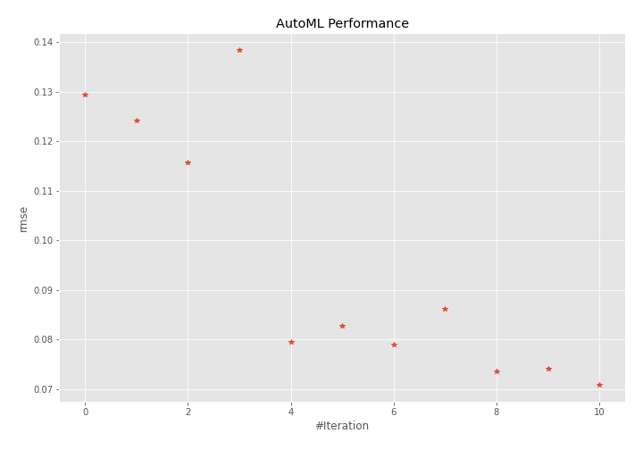
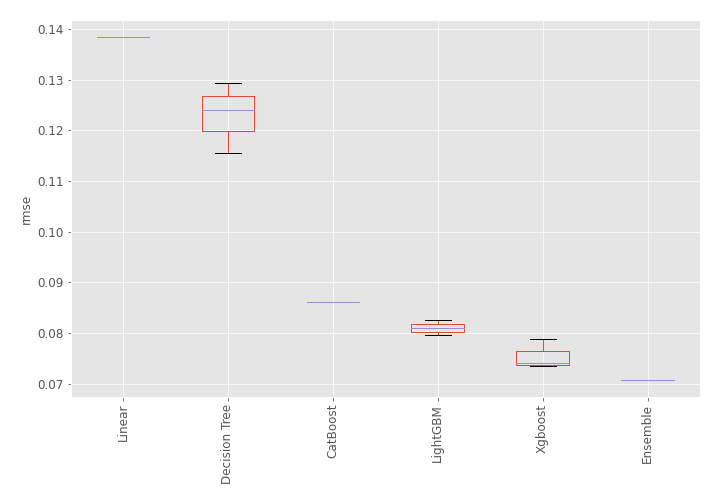
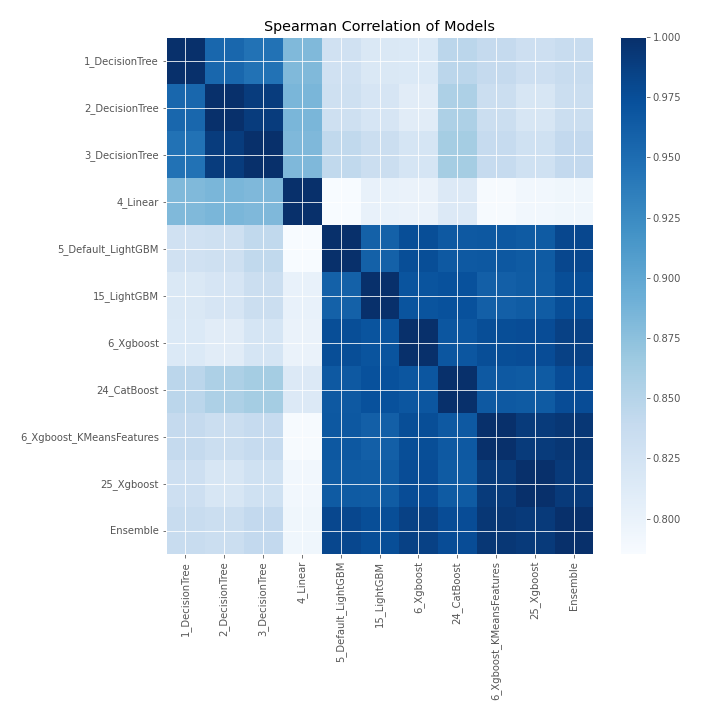

# AutoML Leaderboard

| Best model   | name                                                           | model_type    | metric_type   |   metric_value |   train_time |
|:-------------|:---------------------------------------------------------------|:--------------|:--------------|---------------:|-------------:|
|              | [1_DecisionTree](1_DecisionTree/README.md)                     | Decision Tree | rmse          |      0.129322  |         0.43 |
|              | [2_DecisionTree](2_DecisionTree/README.md)                     | Decision Tree | rmse          |      0.124093  |         0.41 |
|              | [3_DecisionTree](3_DecisionTree/README.md)                     | Decision Tree | rmse          |      0.115595  |         0.43 |
|              | [4_Linear](4_Linear/README.md)                                 | Linear        | rmse          |      0.138429  |         0.49 |
|              | [5_Default_LightGBM](5_Default_LightGBM/README.md)             | LightGBM      | rmse          |      0.0795185 |         0.76 |
|              | [15_LightGBM](15_LightGBM/README.md)                           | LightGBM      | rmse          |      0.082623  |         0.68 |
|              | [6_Xgboost](6_Xgboost/README.md)                               | Xgboost       | rmse          |      0.0788767 |         0.88 |
|              | [24_CatBoost](24_CatBoost/README.md)                           | CatBoost      | rmse          |      0.0862162 |         1.3  |
|              | [6_Xgboost_KMeansFeatures](6_Xgboost_KMeansFeatures/README.md) | Xgboost       | rmse          |      0.073533  |         1.55 |
|              | [25_Xgboost](25_Xgboost/README.md)                             | Xgboost       | rmse          |      0.0740041 |         1.16 |
| **the best** | [Ensemble](Ensemble/README.md)                                 | Ensemble      | rmse          |      0.0707708 |         0.27 |

### AutoML Performance

### AutoML Performance Boxplot

### Spearman Correlation of Models

