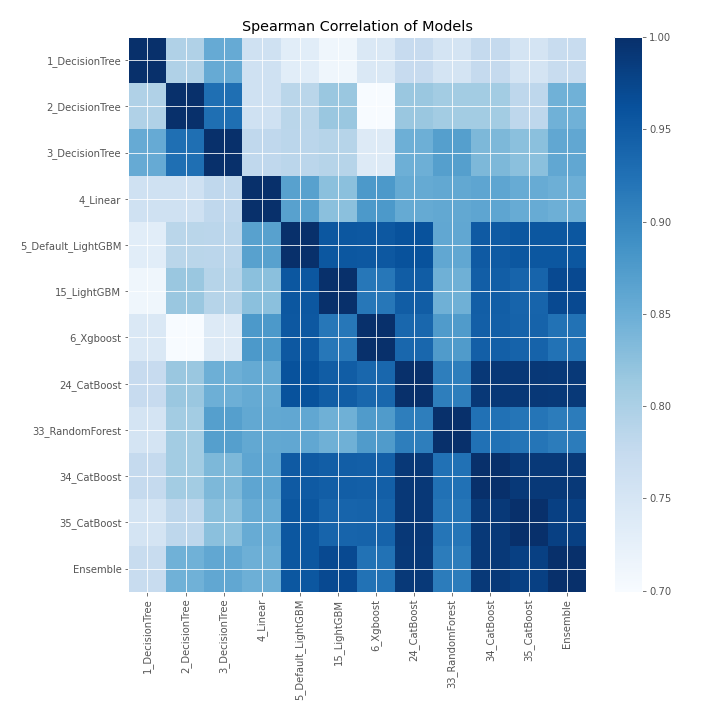

# AutoML Leaderboard

| Best model   | name                                               | model_type    | metric_type   |   metric_value |   train_time |
|:-------------|:---------------------------------------------------|:--------------|:--------------|---------------:|-------------:|
|              | [1_DecisionTree](1_DecisionTree/README.md)         | Decision Tree | rmse          |      0.175068  |         0.38 |
|              | [2_DecisionTree](2_DecisionTree/README.md)         | Decision Tree | rmse          |      1.21307   |         0.38 |
|              | [3_DecisionTree](3_DecisionTree/README.md)         | Decision Tree | rmse          |      0.138135  |         0.39 |
|              | [4_Linear](4_Linear/README.md)                     | Linear        | rmse          |      0.17727   |         0.4  |
|              | [5_Default_LightGBM](5_Default_LightGBM/README.md) | LightGBM      | rmse          |      0.114923  |         0.77 |
|              | [15_LightGBM](15_LightGBM/README.md)               | LightGBM      | rmse          |      0.111136  |         0.67 |
|              | [6_Xgboost](6_Xgboost/README.md)                   | Xgboost       | rmse          |      0.132098  |         0.56 |
|              | [24_CatBoost](24_CatBoost/README.md)               | CatBoost      | rmse          |      0.105991  |         1.09 |
|              | [33_RandomForest](33_RandomForest/README.md)       | Random Forest | rmse          |      0.141182  |         0.73 |
|              | [34_CatBoost](34_CatBoost/README.md)               | CatBoost      | rmse          |      0.100749  |         1.45 |
|              | [35_CatBoost](35_CatBoost/README.md)               | CatBoost      | rmse          |      0.109579  |         0.95 |
| **the best** | [Ensemble](Ensemble/README.md)                     | Ensemble      | rmse          |      0.0931696 |         0.29 |

### AutoML Performance

### AutoML Performance Boxplot

### Spearman Correlation of Models

