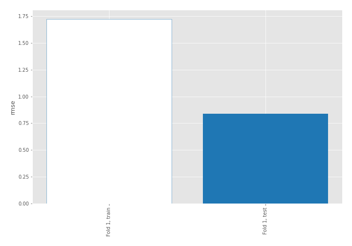
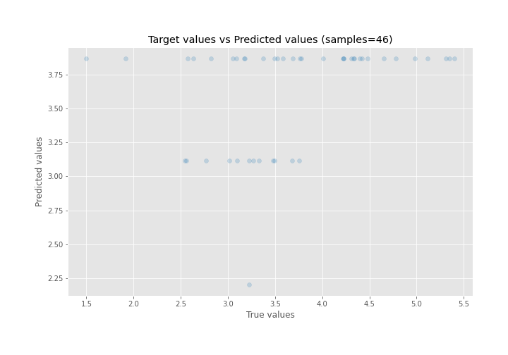
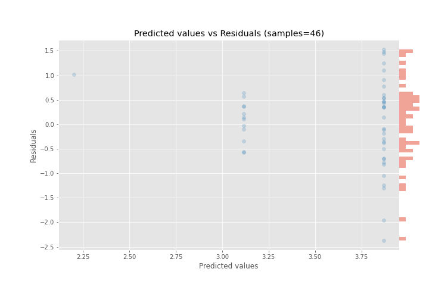

# Summary of 1_DecisionTree

[<< Go back](../README.md)

## Decision Tree
- **n_jobs**: -1
- **criterion**: mse
- **max_depth**: 3
- **explain_level**: 0

## Validation
 - **validation_type**: split
 - **train_ratio**: 0.9
 - **shuffle**: True

## Optimized metric
rmse

## Training time

0.2 seconds

### Metric details:
| Metric   |     Score |
|:---------|----------:|
| MAE      | 0.665329  |
| MSE      | 0.704125  |
| RMSE     | 0.839121  |
| R2       | 0.0906528 |
| MAPE     | 0.210788  |

## Learning curves

## True vs Predicted

## Predicted vs Residuals

[<< Go back](../README.md)
