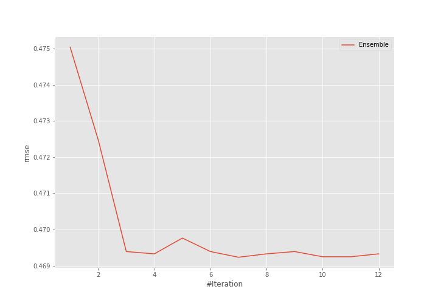
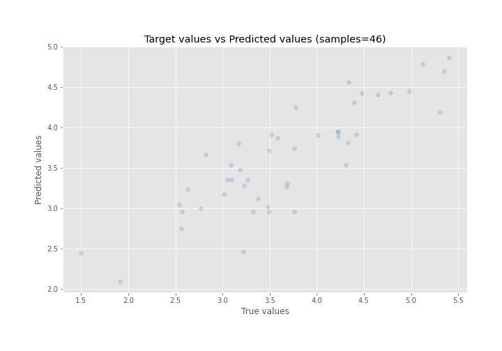
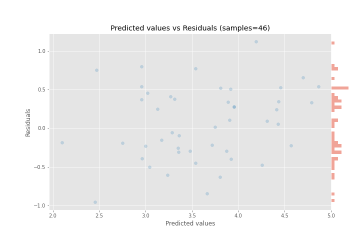

# Summary of Ensemble

[<< Go back](../README.md)

## Ensemble structure
| Model       |   Weight |
|:------------|---------:|
| 34_LightGBM |        2 |
| 36_CatBoost |        5 |

### Metric details:
| Metric   |    Score |
|:---------|---------:|
| MAE      | 0.400459 |
| MSE      | 0.220181 |
| RMSE     | 0.469234 |
| R2       | 0.715646 |
| MAPE     | 0.118919 |

## Learning curves

## True vs Predicted

## Predicted vs Residuals

[<< Go back](../README.md)
