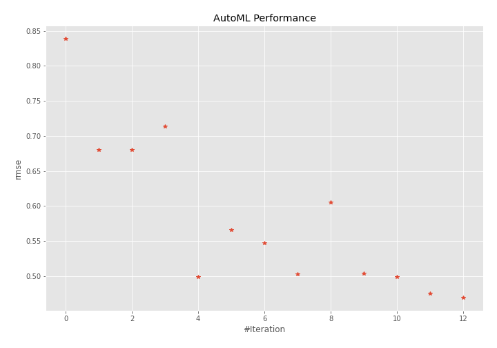
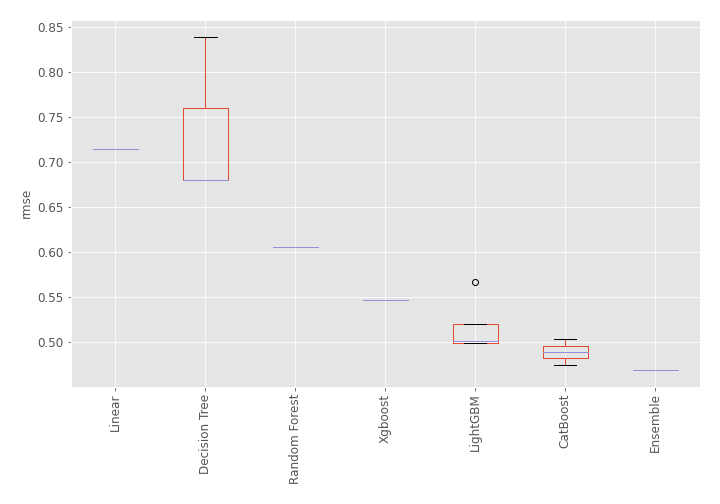
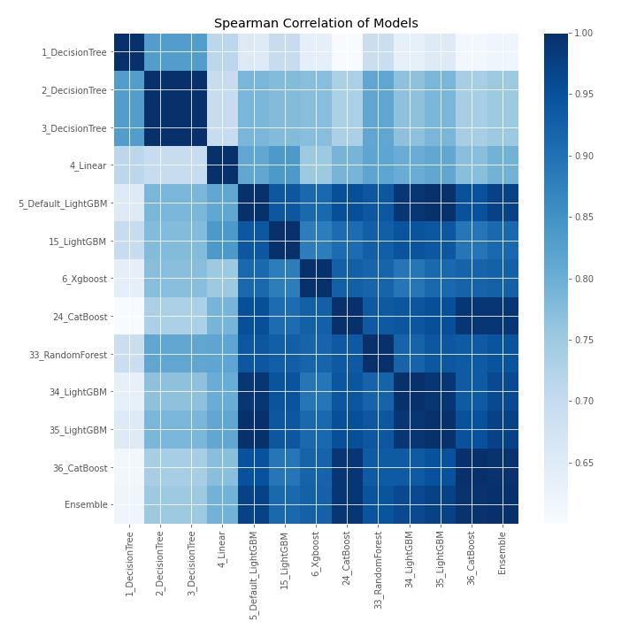

# AutoML Leaderboard

| Best model   | name                                               | model_type    | metric_type   |   metric_value |   train_time |
|:-------------|:---------------------------------------------------|:--------------|:--------------|---------------:|-------------:|
|              | [1_DecisionTree](1_DecisionTree/README.md)         | Decision Tree | rmse          |       0.839121 |         0.4  |
|              | [2_DecisionTree](2_DecisionTree/README.md)         | Decision Tree | rmse          |       0.679976 |         0.36 |
|              | [3_DecisionTree](3_DecisionTree/README.md)         | Decision Tree | rmse          |       0.679976 |         0.38 |
|              | [4_Linear](4_Linear/README.md)                     | Linear        | rmse          |       0.714238 |         0.41 |
|              | [5_Default_LightGBM](5_Default_LightGBM/README.md) | LightGBM      | rmse          |       0.499307 |         0.79 |
|              | [15_LightGBM](15_LightGBM/README.md)               | LightGBM      | rmse          |       0.566461 |         0.67 |
|              | [6_Xgboost](6_Xgboost/README.md)                   | Xgboost       | rmse          |       0.546877 |         0.73 |
|              | [24_CatBoost](24_CatBoost/README.md)               | CatBoost      | rmse          |       0.503224 |         0.99 |
|              | [33_RandomForest](33_RandomForest/README.md)       | Random Forest | rmse          |       0.605435 |         0.72 |
|              | [34_LightGBM](34_LightGBM/README.md)               | LightGBM      | rmse          |       0.504214 |         0.53 |
|              | [35_LightGBM](35_LightGBM/README.md)               | LightGBM      | rmse          |       0.499307 |         0.61 |
|              | [36_CatBoost](36_CatBoost/README.md)               | CatBoost      | rmse          |       0.475038 |         1.31 |
| **the best** | [Ensemble](Ensemble/README.md)                     | Ensemble      | rmse          |       0.469234 |         0.33 |

### AutoML Performance

### AutoML Performance Boxplot

### Spearman Correlation of Models

