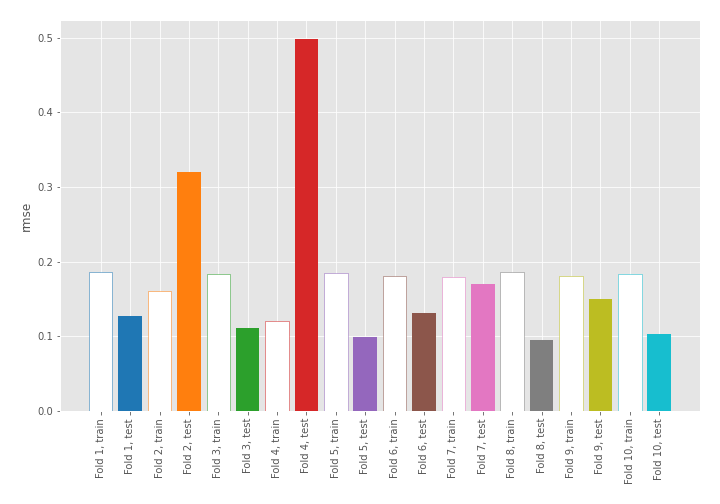
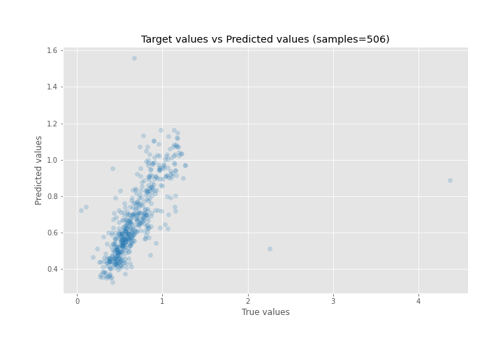
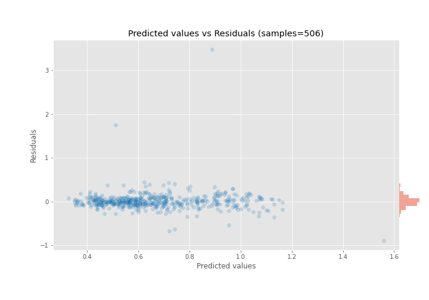

# Summary of 11_Default_NearestNeighbors

[<< Go back](../README.md)

## k-Nearest Neighbors (Nearest Neighbors)
- **n_jobs**: -1
- **n_neighbors**: 5
- **weights**: uniform
- **explain_level**: 0

## Validation
 - **validation_type**: kfold
 - **shuffle**: True
 - **k_folds**: 10

## Optimized metric
rmse

## Training time

2.7 seconds

### Metric details:
| Metric   |     Score |
|:---------|----------:|
| MAE      | 0.103098  |
| MSE      | 0.0479953 |
| RMSE     | 0.219078  |
| R2       | 0.43088   |
| MAPE     | 0.187622  |

## Learning curves

## True vs Predicted

## Predicted vs Residuals

[<< Go back](../README.md)
