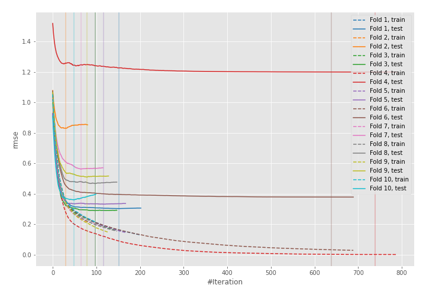
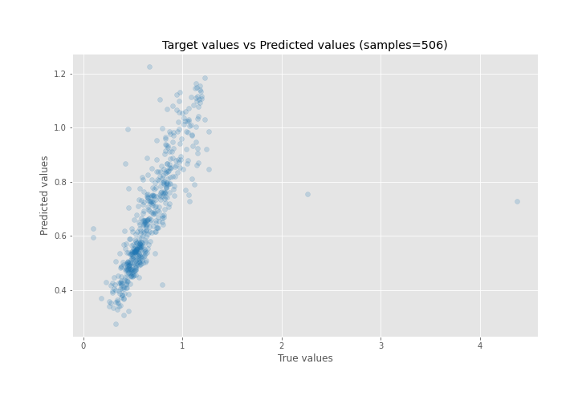
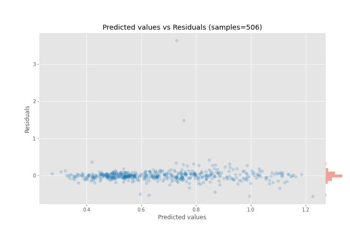

# Summary of 12_Xgboost

[<< Go back](../README.md)

## Extreme Gradient Boosting (Xgboost)
- **n_jobs**: -1
- **objective**: reg:squarederror
- **eta**: 0.075
- **max_depth**: 8
- **min_child_weight**: 5
- **subsample**: 1.0
- **colsample_bytree**: 1.0
- **eval_metric**: rmse
- **explain_level**: 0

## Validation
 - **validation_type**: kfold
 - **shuffle**: True
 - **k_folds**: 10

## Optimized metric
rmse

## Training time

5.7 seconds

### Metric details:
| Metric   |     Score |
|:---------|----------:|
| MAE      | 0.0824345 |
| MSE      | 0.0420778 |
| RMSE     | 0.205129  |
| R2       | 0.50028   |
| MAPE     | 0.135405  |

## Learning curves

## True vs Predicted

## Predicted vs Residuals

[<< Go back](../README.md)
