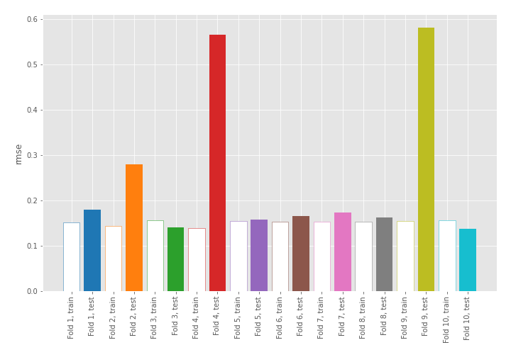
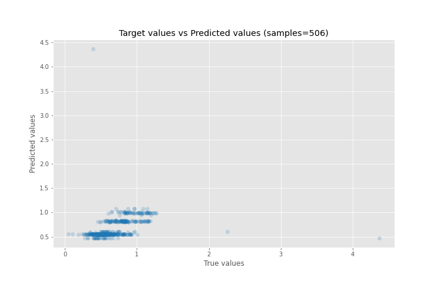
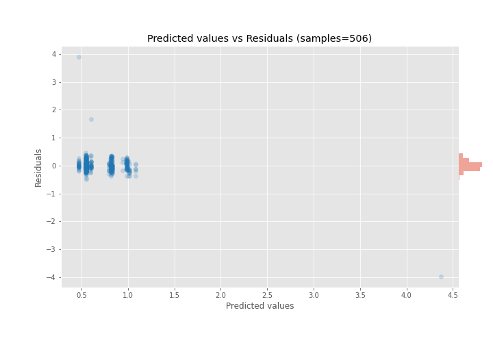

# Summary of 1_DecisionTree

[<< Go back](../README.md)

## Decision Tree
- **n_jobs**: -1
- **criterion**: mse
- **max_depth**: 3
- **explain_level**: 0

## Validation
 - **validation_type**: kfold
 - **shuffle**: True
 - **k_folds**: 10

## Optimized metric
rmse

## Training time

2.0 seconds

### Metric details:
| Metric   |      Score |
|:---------|-----------:|
| MAE      |  0.142374  |
| MSE      |  0.0917241 |
| RMSE     |  0.30286   |
| R2       | -0.0876477 |
| MAPE     |  0.254095  |

## Learning curves

## True vs Predicted

## Predicted vs Residuals

[<< Go back](../README.md)
