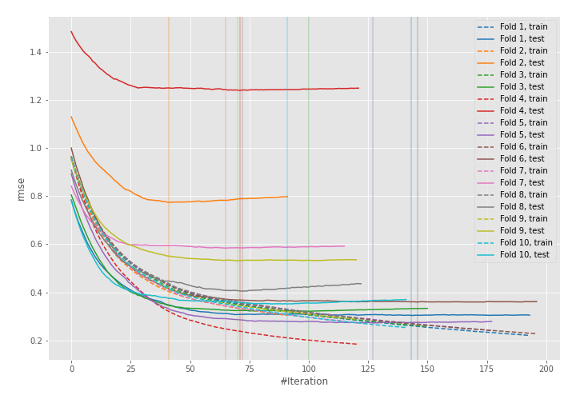
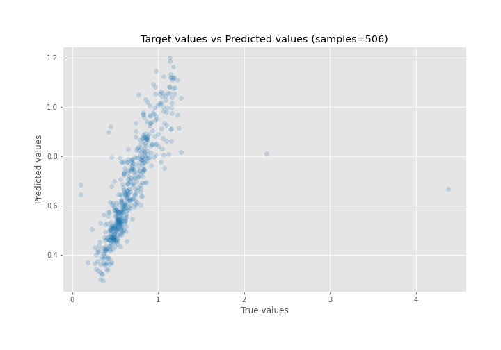
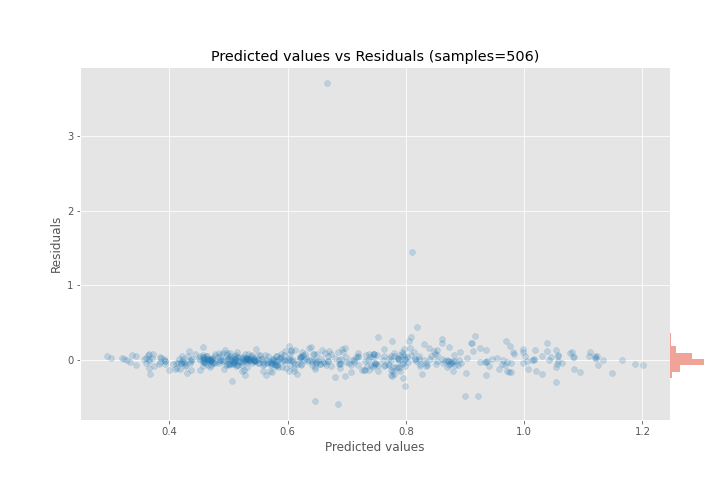

# Summary of 24_LightGBM

[<< Go back](../README.md)

## LightGBM
- **n_jobs**: -1
- **objective**: regression
- **num_leaves**: 95
- **learning_rate**: 0.05
- **feature_fraction**: 1.0
- **bagging_fraction**: 1.0
- **min_data_in_leaf**: 10
- **metric**: rmse
- **custom_eval_metric_name**: None
- **explain_level**: 0

## Validation
 - **validation_type**: kfold
 - **shuffle**: True
 - **k_folds**: 10

## Optimized metric
rmse

## Training time

5.1 seconds

### Metric details:
| Metric   |     Score |
|:---------|----------:|
| MAE      | 0.0805915 |
| MSE      | 0.0417909 |
| RMSE     | 0.204428  |
| R2       | 0.503687  |
| MAPE     | 0.135481  |

## Learning curves

## True vs Predicted

## Predicted vs Residuals

[<< Go back](../README.md)
