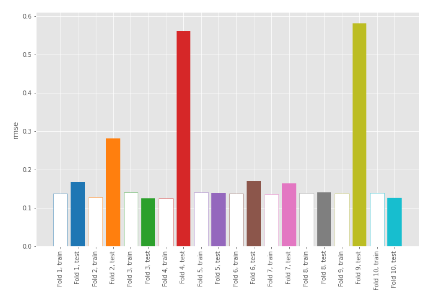
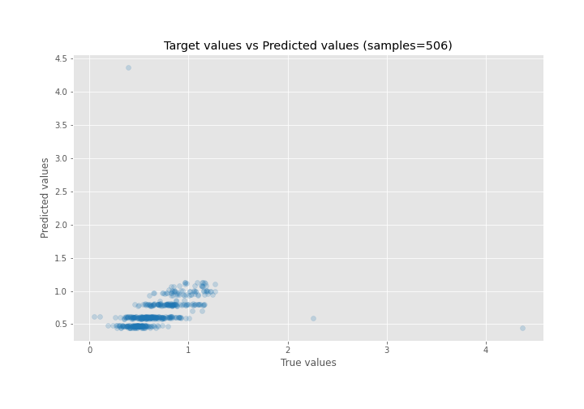
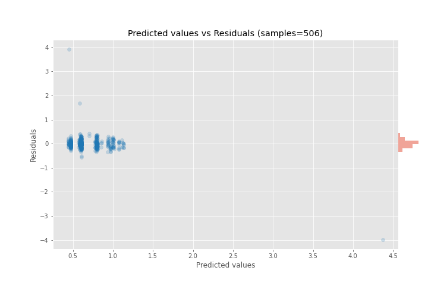

# Summary of 2_DecisionTree

[<< Go back](../README.md)

## Decision Tree
- **n_jobs**: -1
- **criterion**: mse
- **max_depth**: 4
- **explain_level**: 0

## Validation
 - **validation_type**: kfold
 - **shuffle**: True
 - **k_folds**: 10

## Optimized metric
rmse

## Training time

1.9 seconds

### Metric details:
| Metric   |      Score |
|:---------|-----------:|
| MAE      |  0.130922  |
| MSE      |  0.0886086 |
| RMSE     |  0.297672  |
| R2       | -0.0507052 |
| MAPE     |  0.236601  |

## Learning curves

## True vs Predicted

## Predicted vs Residuals

[<< Go back](../README.md)
