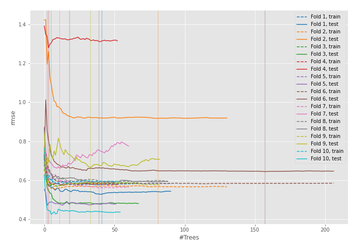
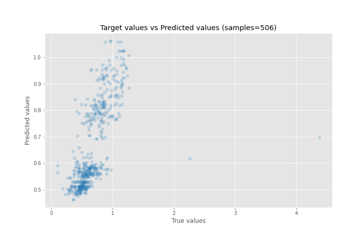
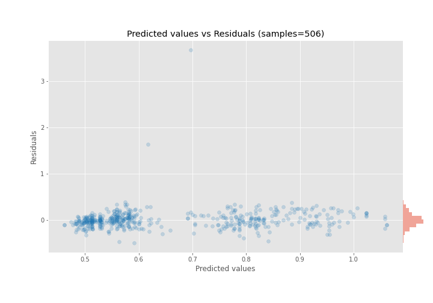

# Summary of 40_RandomForest

[<< Go back](../README.md)

## Random Forest
- **n_jobs**: -1
- **criterion**: mse
- **max_features**: 0.7
- **min_samples_split**: 50
- **max_depth**: 3
- **eval_metric_name**: rmse
- **explain_level**: 0

## Validation
 - **validation_type**: kfold
 - **shuffle**: True
 - **k_folds**: 10

## Optimized metric
rmse

## Training time

6.3 seconds

### Metric details:
| Metric   |     Score |
|:---------|----------:|
| MAE      | 0.118611  |
| MSE      | 0.0516058 |
| RMSE     | 0.227169  |
| R2       | 0.387124  |
| MAPE     | 0.198693  |

## Learning curves

## True vs Predicted

## Predicted vs Residuals

[<< Go back](../README.md)
