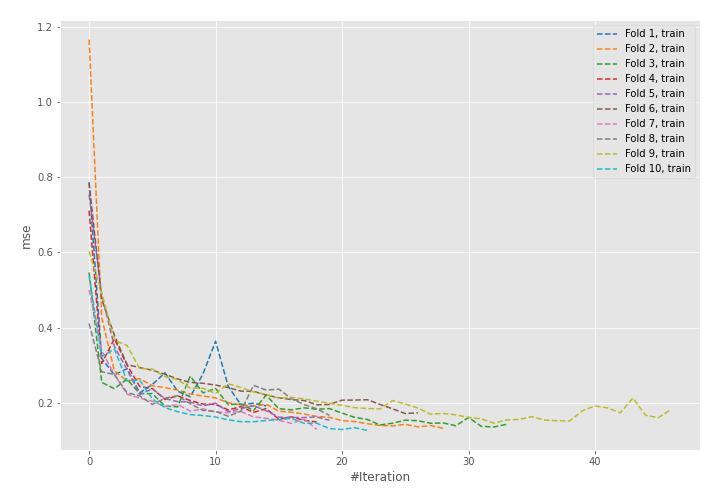
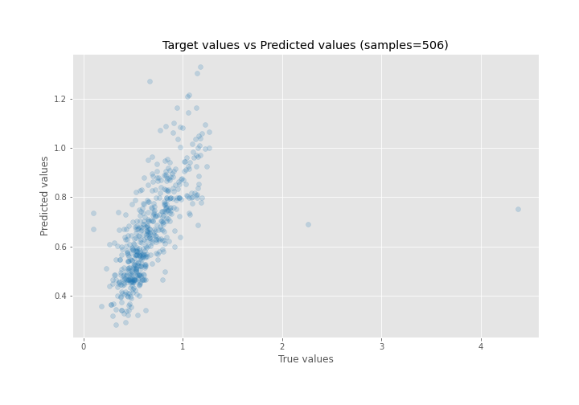
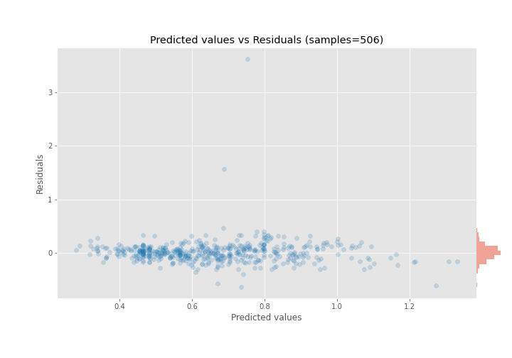

# Summary of 57_NeuralNetwork

[<< Go back](../README.md)

## Neural Network
- **n_jobs**: -1
- **dense_1_size**: 32
- **dense_2_size**: 4
- **learning_rate**: 0.05
- **explain_level**: 0

## Validation
 - **validation_type**: kfold
 - **shuffle**: True
 - **k_folds**: 10

## Optimized metric
rmse

## Training time

3.3 seconds

### Metric details:
| Metric   |     Score |
|:---------|----------:|
| MAE      | 0.118454  |
| MSE      | 0.0510085 |
| RMSE     | 0.225851  |
| R2       | 0.394218  |
| MAPE     | 0.197043  |

## Learning curves

## True vs Predicted

## Predicted vs Residuals

[<< Go back](../README.md)
