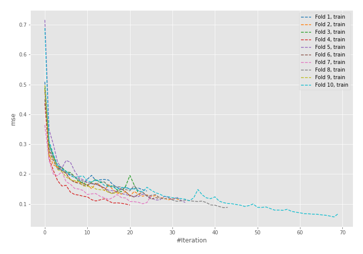
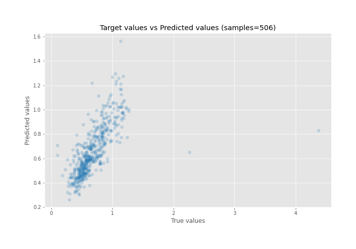
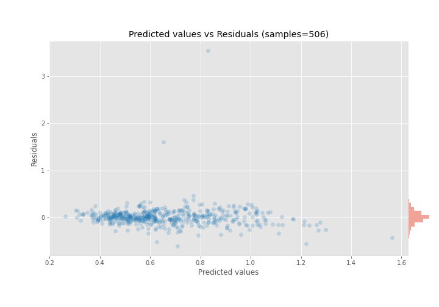

# Summary of 58_NeuralNetwork

[<< Go back](../README.md)

## Neural Network
- **n_jobs**: -1
- **dense_1_size**: 64
- **dense_2_size**: 16
- **learning_rate**: 0.01
- **explain_level**: 0

## Validation
 - **validation_type**: kfold
 - **shuffle**: True
 - **k_folds**: 10

## Optimized metric
rmse

## Training time

4.3 seconds

### Metric details:
| Metric   |     Score |
|:---------|----------:|
| MAE      | 0.109378  |
| MSE      | 0.0478435 |
| RMSE     | 0.218732  |
| R2       | 0.431805  |
| MAPE     | 0.180721  |

## Learning curves

## True vs Predicted

## Predicted vs Residuals

[<< Go back](../README.md)
