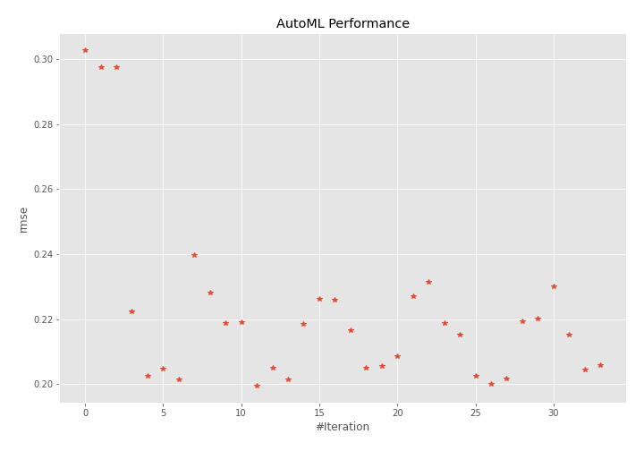
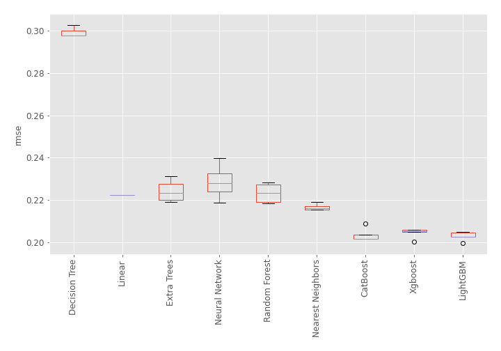

# AutoML Leaderboard

| Best model   | name                                                                 | model_type        | metric_type   |   metric_value |   train_time |
|:-------------|:---------------------------------------------------------------------|:------------------|:--------------|---------------:|-------------:|
|              | [1_DecisionTree](1_DecisionTree/README.md)                           | Decision Tree     | rmse          |       0.30286  |         2.3  |
|              | [2_DecisionTree](2_DecisionTree/README.md)                           | Decision Tree     | rmse          |       0.297672 |         2.15 |
|              | [3_DecisionTree](3_DecisionTree/README.md)                           | Decision Tree     | rmse          |       0.297672 |         2.25 |
|              | [4_Linear](4_Linear/README.md)                                       | Linear            | rmse          |       0.222343 |         2.51 |
|              | [5_Default_LightGBM](5_Default_LightGBM/README.md)                   | LightGBM          | rmse          |       0.202716 |         3.34 |
|              | [6_Default_Xgboost](6_Default_Xgboost/README.md)                     | Xgboost           | rmse          |       0.204719 |         5.64 |
|              | [7_Default_CatBoost](7_Default_CatBoost/README.md)                   | CatBoost          | rmse          |       0.201506 |         4.46 |
|              | [8_Default_NeuralNetwork](8_Default_NeuralNetwork/README.md)         | Neural Network    | rmse          |       0.239699 |         3.14 |
|              | [9_Default_RandomForest](9_Default_RandomForest/README.md)           | Random Forest     | rmse          |       0.228172 |         7.06 |
|              | [10_Default_ExtraTrees](10_Default_ExtraTrees/README.md)             | Extra Trees       | rmse          |       0.218936 |         5.14 |
|              | [11_Default_NearestNeighbors](11_Default_NearestNeighbors/README.md) | Nearest Neighbors | rmse          |       0.219078 |         2.99 |
| **the best** | [21_LightGBM](21_LightGBM/README.md)                                 | LightGBM          | rmse          |       0.199491 |         3.49 |
|              | [12_Xgboost](12_Xgboost/README.md)                                   | Xgboost           | rmse          |       0.205129 |         6.14 |
|              | [30_CatBoost](30_CatBoost/README.md)                                 | CatBoost          | rmse          |       0.201471 |        10.35 |
|              | [39_RandomForest](39_RandomForest/README.md)                         | Random Forest     | rmse          |       0.218505 |         6.19 |
|              | [48_ExtraTrees](48_ExtraTrees/README.md)                             | Extra Trees       | rmse          |       0.226142 |         5.52 |
|              | [57_NeuralNetwork](57_NeuralNetwork/README.md)                       | Neural Network    | rmse          |       0.225851 |         3.61 |
|              | [66_NearestNeighbors](66_NearestNeighbors/README.md)                 | Nearest Neighbors | rmse          |       0.216571 |         3.51 |
|              | [22_LightGBM](22_LightGBM/README.md)                                 | LightGBM          | rmse          |       0.205017 |         3.93 |
|              | [13_Xgboost](13_Xgboost/README.md)                                   | Xgboost           | rmse          |       0.205748 |         6.14 |
|              | [31_CatBoost](31_CatBoost/README.md)                                 | CatBoost          | rmse          |       0.208763 |         5.69 |
|              | [40_RandomForest](40_RandomForest/README.md)                         | Random Forest     | rmse          |       0.227169 |         6.64 |
|              | [49_ExtraTrees](49_ExtraTrees/README.md)                             | Extra Trees       | rmse          |       0.231374 |         7.15 |
|              | [58_NeuralNetwork](58_NeuralNetwork/README.md)                       | Neural Network    | rmse          |       0.218732 |         4.65 |
|              | [67_NearestNeighbors](67_NearestNeighbors/README.md)                 | Nearest Neighbors | rmse          |       0.215304 |         4.14 |
|              | [23_LightGBM](23_LightGBM/README.md)                                 | LightGBM          | rmse          |       0.202599 |         4.52 |
|              | [14_Xgboost](14_Xgboost/README.md)                                   | Xgboost           | rmse          |       0.200193 |         6.52 |
|              | [32_CatBoost](32_CatBoost/README.md)                                 | CatBoost          | rmse          |       0.201771 |         6.63 |
|              | [41_RandomForest](41_RandomForest/README.md)                         | Random Forest     | rmse          |       0.21932  |         6.58 |
|              | [50_ExtraTrees](50_ExtraTrees/README.md)                             | Extra Trees       | rmse          |       0.220255 |         7.75 |
|              | [59_NeuralNetwork](59_NeuralNetwork/README.md)                       | Neural Network    | rmse          |       0.230056 |         5.61 |
|              | [68_NearestNeighbors](68_NearestNeighbors/README.md)                 | Nearest Neighbors | rmse          |       0.215304 |         4.44 |
|              | [24_LightGBM](24_LightGBM/README.md)                                 | LightGBM          | rmse          |       0.204428 |         5.51 |
|              | [15_Xgboost](15_Xgboost/README.md)                                   | Xgboost           | rmse          |       0.205873 |         5.03 |

### AutoML Performance

### AutoML Performance Boxplot
