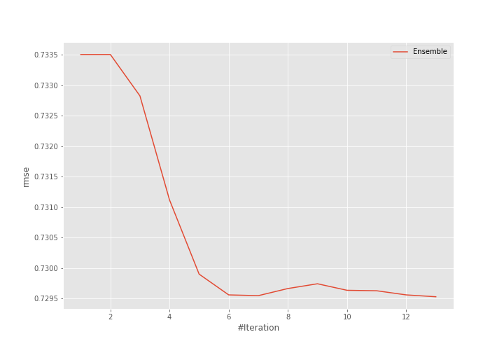
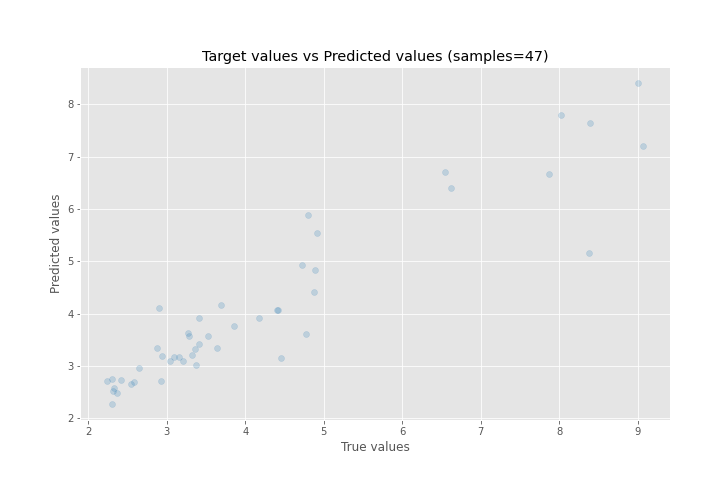
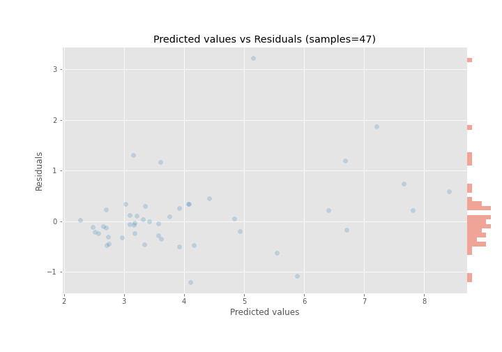

# Summary of Ensemble

[<< Go back](../README.md)

## Ensemble structure
| Model             |   Weight |
|:------------------|---------:|
| 25_CatBoost       |        2 |
| 6_Default_Xgboost |        2 |
| 7_Xgboost         |        9 |

### Metric details:
| Metric   |    Score |
|:---------|---------:|
| MAE      | 0.45518  |
| MSE      | 0.532214 |
| RMSE     | 0.72953  |
| R2       | 0.856098 |
| MAPE     | 0.102047 |

## Learning curves

## True vs Predicted

## Predicted vs Residuals

[<< Go back](../README.md)
