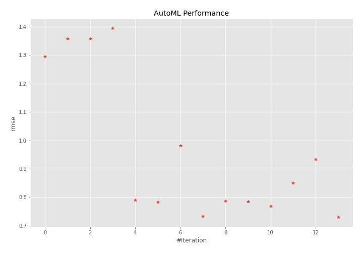
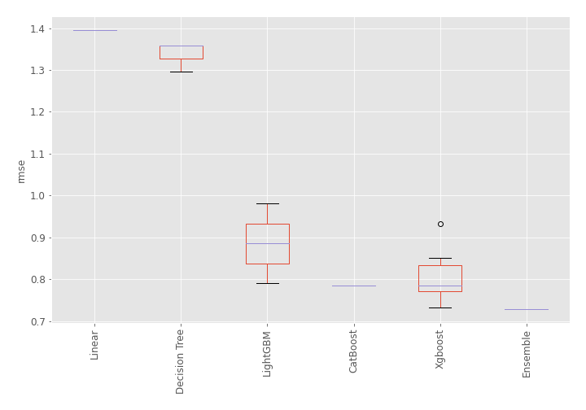
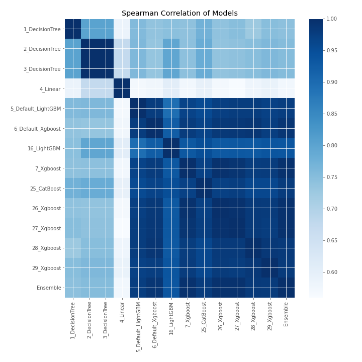

# AutoML Leaderboard

| Best model   | name                                               | model_type    | metric_type   |   metric_value |   train_time |
|:-------------|:---------------------------------------------------|:--------------|:--------------|---------------:|-------------:|
|              | [1_DecisionTree](1_DecisionTree/README.md)         | Decision Tree | rmse          |       1.29604  |         0.37 |
|              | [2_DecisionTree](2_DecisionTree/README.md)         | Decision Tree | rmse          |       1.35809  |         0.36 |
|              | [3_DecisionTree](3_DecisionTree/README.md)         | Decision Tree | rmse          |       1.35809  |         0.37 |
|              | [4_Linear](4_Linear/README.md)                     | Linear        | rmse          |       1.39491  |         0.4  |
|              | [5_Default_LightGBM](5_Default_LightGBM/README.md) | LightGBM      | rmse          |       0.790628 |         0.63 |
|              | [6_Default_Xgboost](6_Default_Xgboost/README.md)   | Xgboost       | rmse          |       0.783373 |         0.87 |
|              | [16_LightGBM](16_LightGBM/README.md)               | LightGBM      | rmse          |       0.981289 |         0.51 |
|              | [7_Xgboost](7_Xgboost/README.md)                   | Xgboost       | rmse          |       0.733505 |         0.57 |
|              | [25_CatBoost](25_CatBoost/README.md)               | CatBoost      | rmse          |       0.785923 |         1.29 |
|              | [26_Xgboost](26_Xgboost/README.md)                 | Xgboost       | rmse          |       0.785652 |         0.61 |
|              | [27_Xgboost](27_Xgboost/README.md)                 | Xgboost       | rmse          |       0.768327 |         0.68 |
|              | [28_Xgboost](28_Xgboost/README.md)                 | Xgboost       | rmse          |       0.85071  |         0.61 |
|              | [29_Xgboost](29_Xgboost/README.md)                 | Xgboost       | rmse          |       0.933263 |         0.66 |
| **the best** | [Ensemble](Ensemble/README.md)                     | Ensemble      | rmse          |       0.72953  |         0.36 |

### AutoML Performance

### AutoML Performance Boxplot

### Spearman Correlation of Models

