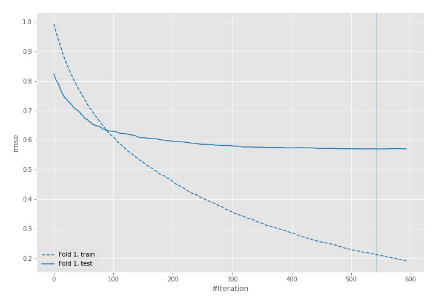
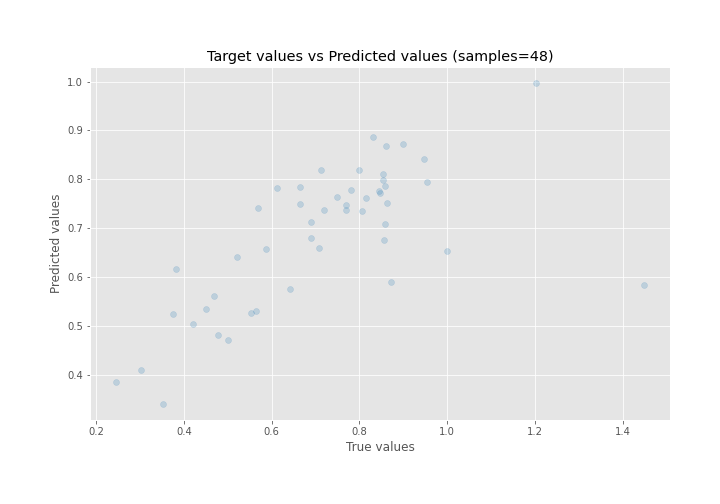
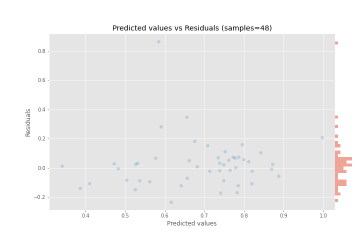

# Summary of 34_CatBoost

[<< Go back](../README.md)

## CatBoost
- **n_jobs**: -1
- **learning_rate**: 0.025
- **depth**: 8
- **rsm**: 0.8
- **loss_function**: RMSE
- **eval_metric**: RMSE
- **explain_level**: 0

## Validation
 - **validation_type**: split
 - **train_ratio**: 0.9
 - **shuffle**: True

## Optimized metric
rmse

## Training time

1.1 seconds

### Metric details:
| Metric   |     Score |
|:---------|----------:|
| MAE      | 0.104795  |
| MSE      | 0.0287041 |
| RMSE     | 0.169423  |
| R2       | 0.441685  |
| MAPE     | 0.152963  |

## Learning curves

## True vs Predicted

## Predicted vs Residuals

[<< Go back](../README.md)
