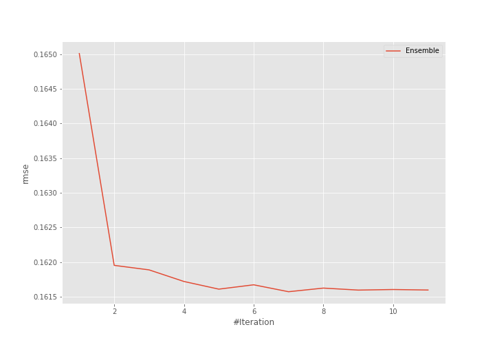
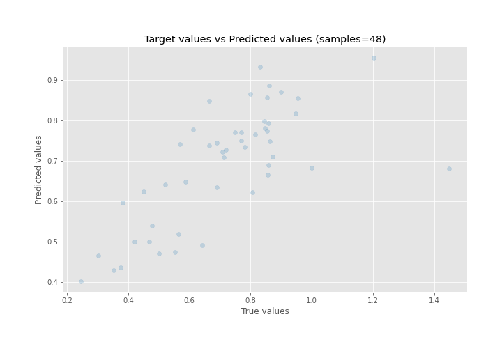
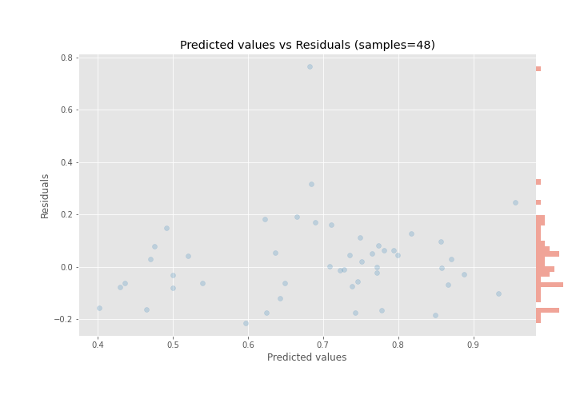

# Summary of Ensemble

[<< Go back](../README.md)

## Ensemble structure
| Model              |   Weight |
|:-------------------|---------:|
| 35_CatBoost        |        2 |
| 4_Linear           |        4 |
| 5_Default_LightGBM |        1 |

### Metric details:
| Metric   |     Score |
|:---------|----------:|
| MAE      | 0.109054  |
| MSE      | 0.0261055 |
| RMSE     | 0.161572  |
| R2       | 0.492229  |
| MAPE     | 0.164817  |

## Learning curves

## True vs Predicted

## Predicted vs Residuals

[<< Go back](../README.md)
