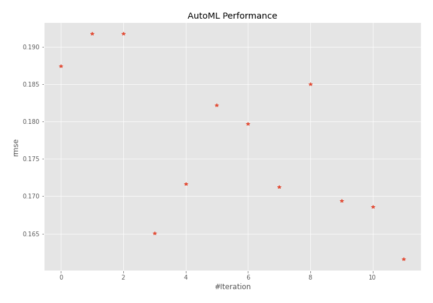
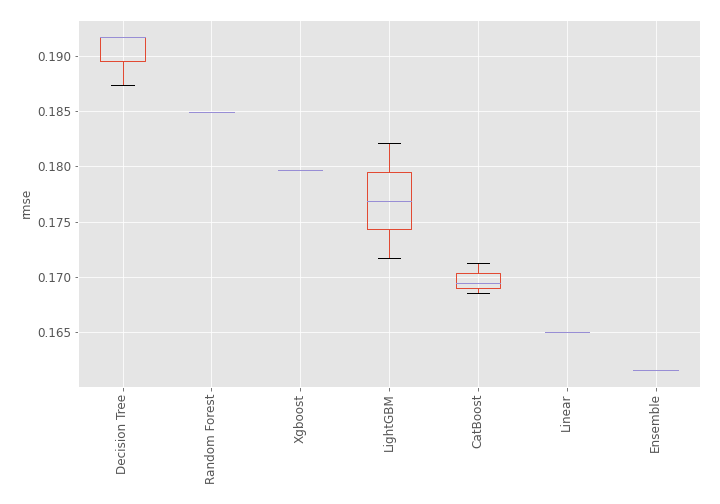
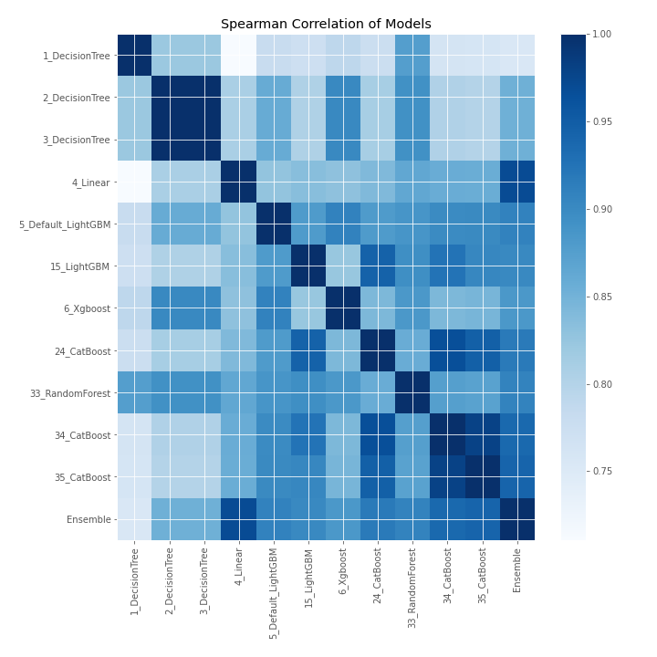

# AutoML Leaderboard

| Best model   | name                                               | model_type    | metric_type   |   metric_value |   train_time |
|:-------------|:---------------------------------------------------|:--------------|:--------------|---------------:|-------------:|
|              | [1_DecisionTree](1_DecisionTree/README.md)         | Decision Tree | rmse          |       0.187411 |         0.38 |
|              | [2_DecisionTree](2_DecisionTree/README.md)         | Decision Tree | rmse          |       0.191759 |         0.42 |
|              | [3_DecisionTree](3_DecisionTree/README.md)         | Decision Tree | rmse          |       0.191759 |         0.39 |
|              | [4_Linear](4_Linear/README.md)                     | Linear        | rmse          |       0.165011 |         0.44 |
|              | [5_Default_LightGBM](5_Default_LightGBM/README.md) | LightGBM      | rmse          |       0.171675 |         0.82 |
|              | [15_LightGBM](15_LightGBM/README.md)               | LightGBM      | rmse          |       0.182144 |         0.57 |
|              | [6_Xgboost](6_Xgboost/README.md)                   | Xgboost       | rmse          |       0.179691 |         0.61 |
|              | [24_CatBoost](24_CatBoost/README.md)               | CatBoost      | rmse          |       0.171268 |         0.98 |
|              | [33_RandomForest](33_RandomForest/README.md)       | Random Forest | rmse          |       0.18497  |         0.7  |
|              | [34_CatBoost](34_CatBoost/README.md)               | CatBoost      | rmse          |       0.169423 |         1.38 |
|              | [35_CatBoost](35_CatBoost/README.md)               | CatBoost      | rmse          |       0.168578 |         0.83 |
| **the best** | [Ensemble](Ensemble/README.md)                     | Ensemble      | rmse          |       0.161572 |         0.29 |

### AutoML Performance

### AutoML Performance Boxplot

### Spearman Correlation of Models

