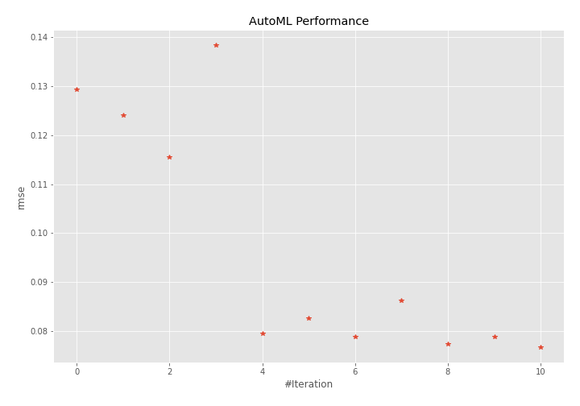
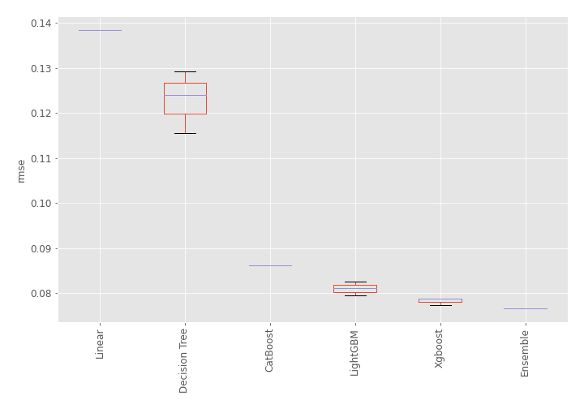
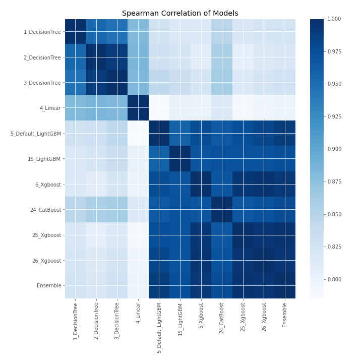

# AutoML Leaderboard

| Best model   | name                                               | model_type    | metric_type   |   metric_value |   train_time |
|:-------------|:---------------------------------------------------|:--------------|:--------------|---------------:|-------------:|
|              | [1_DecisionTree](1_DecisionTree/README.md)         | Decision Tree | rmse          |      0.129322  |         0.41 |
|              | [2_DecisionTree](2_DecisionTree/README.md)         | Decision Tree | rmse          |      0.124093  |         0.37 |
|              | [3_DecisionTree](3_DecisionTree/README.md)         | Decision Tree | rmse          |      0.115595  |         0.39 |
|              | [4_Linear](4_Linear/README.md)                     | Linear        | rmse          |      0.138429  |         0.52 |
|              | [5_Default_LightGBM](5_Default_LightGBM/README.md) | LightGBM      | rmse          |      0.0795185 |         0.97 |
|              | [15_LightGBM](15_LightGBM/README.md)               | LightGBM      | rmse          |      0.082623  |         0.71 |
|              | [6_Xgboost](6_Xgboost/README.md)                   | Xgboost       | rmse          |      0.0788767 |         1.22 |
|              | [24_CatBoost](24_CatBoost/README.md)               | CatBoost      | rmse          |      0.0862162 |         1.39 |
|              | [25_Xgboost](25_Xgboost/README.md)                 | Xgboost       | rmse          |      0.0773974 |         1.28 |
|              | [26_Xgboost](26_Xgboost/README.md)                 | Xgboost       | rmse          |      0.0788254 |         1.05 |
| **the best** | [Ensemble](Ensemble/README.md)                     | Ensemble      | rmse          |      0.0766832 |         0.27 |

### AutoML Performance

### AutoML Performance Boxplot

### Spearman Correlation of Models

