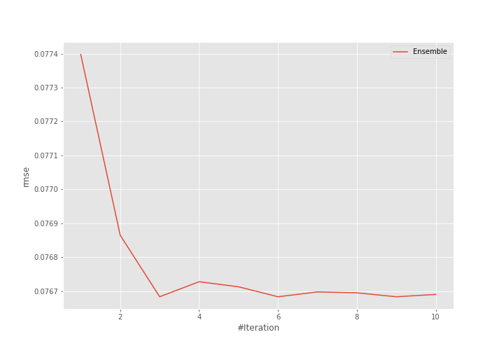
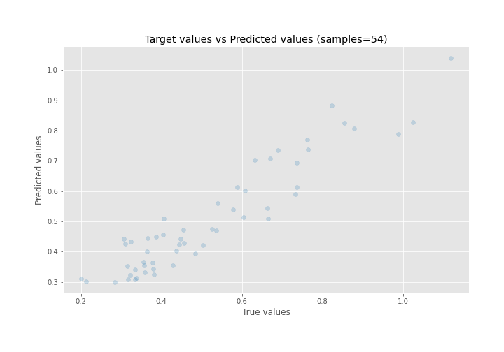
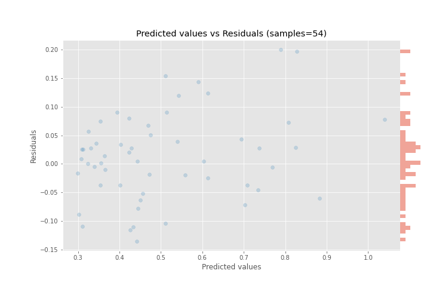

# Summary of Ensemble

[<< Go back](../README.md)

## Ensemble structure
| Model              |   Weight |
|:-------------------|---------:|
| 25_Xgboost         |        2 |
| 5_Default_LightGBM |        1 |

### Metric details:
| Metric   |      Score |
|:---------|-----------:|
| MAE      | 0.0594268  |
| MSE      | 0.00588031 |
| RMSE     | 0.0766832  |
| R2       | 0.868916   |
| MAPE     | 0.125456   |

## Learning curves

## True vs Predicted

## Predicted vs Residuals

[<< Go back](../README.md)
