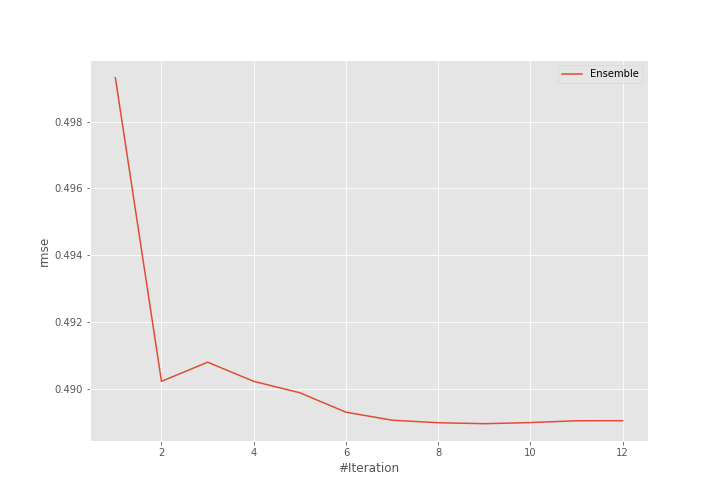
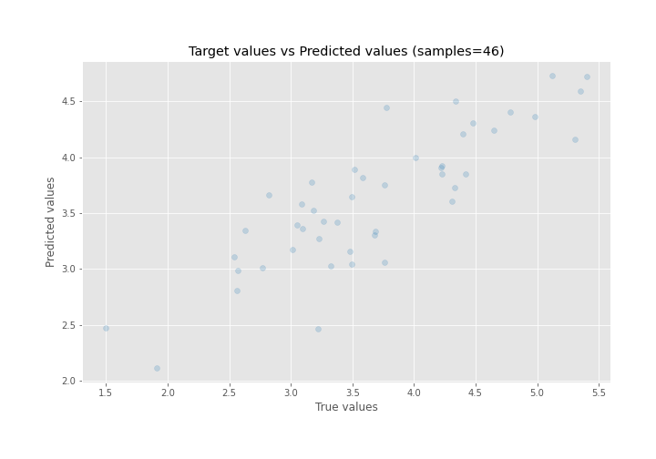
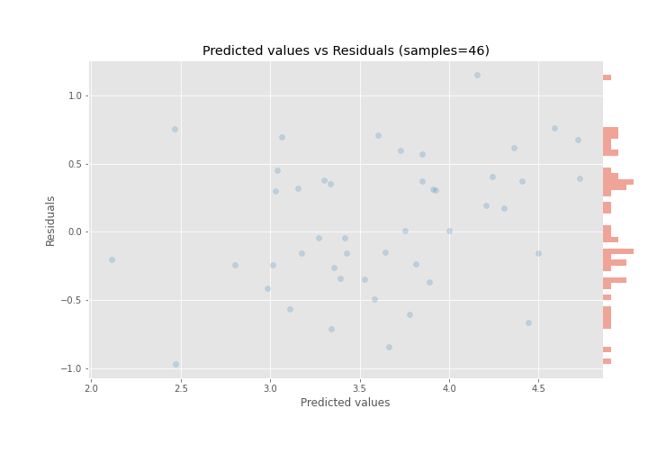

# Summary of Ensemble

[<< Go back](../README.md)

## Ensemble structure
| Model              |   Weight |
|:-------------------|---------:|
| 24_CatBoost        |        4 |
| 25_LightGBM        |        2 |
| 5_Default_LightGBM |        2 |
| 6_Xgboost          |        1 |

### Metric details:
| Metric   |    Score |
|:---------|---------:|
| MAE      | 0.415981 |
| MSE      | 0.239094 |
| RMSE     | 0.488972 |
| R2       | 0.691221 |
| MAPE     | 0.122566 |

## Learning curves

## True vs Predicted

## Predicted vs Residuals

[<< Go back](../README.md)
