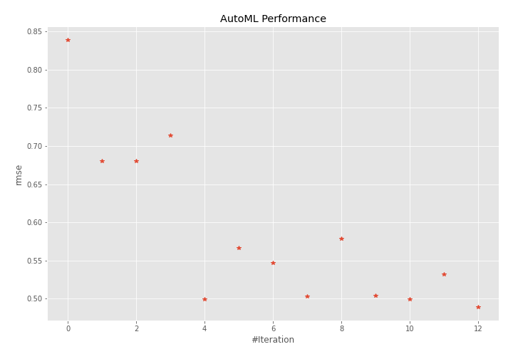
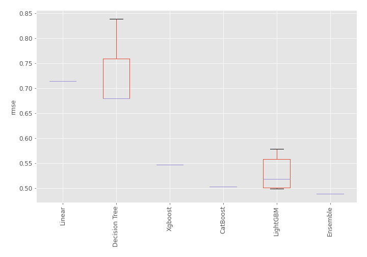
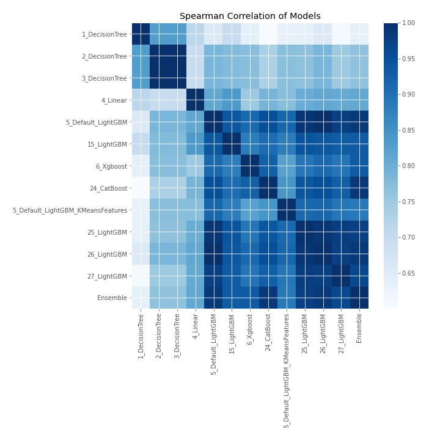

# AutoML Leaderboard

| Best model   | name                                                                             | model_type    | metric_type   |   metric_value |   train_time |
|:-------------|:---------------------------------------------------------------------------------|:--------------|:--------------|---------------:|-------------:|
|              | [1_DecisionTree](1_DecisionTree/README.md)                                       | Decision Tree | rmse          |       0.839121 |         0.44 |
|              | [2_DecisionTree](2_DecisionTree/README.md)                                       | Decision Tree | rmse          |       0.679976 |         0.44 |
|              | [3_DecisionTree](3_DecisionTree/README.md)                                       | Decision Tree | rmse          |       0.679976 |         0.43 |
|              | [4_Linear](4_Linear/README.md)                                                   | Linear        | rmse          |       0.714238 |         0.45 |
|              | [5_Default_LightGBM](5_Default_LightGBM/README.md)                               | LightGBM      | rmse          |       0.499307 |         0.76 |
|              | [15_LightGBM](15_LightGBM/README.md)                                             | LightGBM      | rmse          |       0.566461 |         0.59 |
|              | [6_Xgboost](6_Xgboost/README.md)                                                 | Xgboost       | rmse          |       0.546877 |         0.66 |
|              | [24_CatBoost](24_CatBoost/README.md)                                             | CatBoost      | rmse          |       0.503224 |         1.06 |
|              | [5_Default_LightGBM_KMeansFeatures](5_Default_LightGBM_KMeansFeatures/README.md) | LightGBM      | rmse          |       0.578508 |         1.06 |
|              | [25_LightGBM](25_LightGBM/README.md)                                             | LightGBM      | rmse          |       0.504214 |         0.68 |
|              | [26_LightGBM](26_LightGBM/README.md)                                             | LightGBM      | rmse          |       0.499307 |         0.67 |
|              | [27_LightGBM](27_LightGBM/README.md)                                             | LightGBM      | rmse          |       0.531758 |         0.57 |
| **the best** | [Ensemble](Ensemble/README.md)                                                   | Ensemble      | rmse          |       0.488972 |         0.36 |

### AutoML Performance

### AutoML Performance Boxplot

### Spearman Correlation of Models

