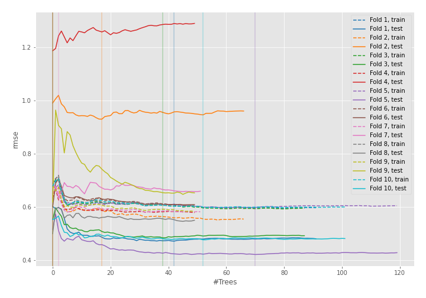
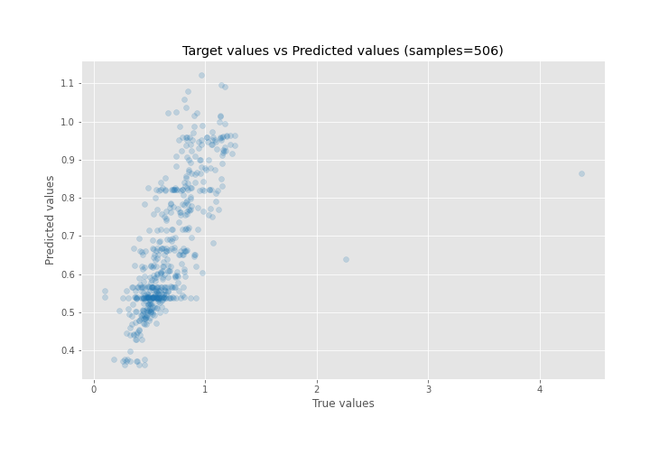
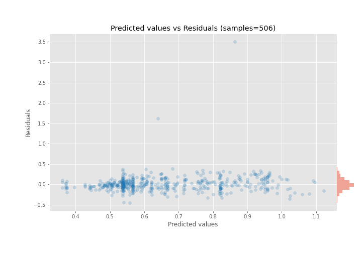

# Summary of 10_Default_ExtraTrees

[<< Go back](../README.md)

## Extra Trees Regressor (Extra Trees)
- **n_jobs**: -1
- **criterion**: mse
- **max_features**: 0.9
- **min_samples_split**: 30
- **max_depth**: 4
- **eval_metric_name**: rmse
- **explain_level**: 0

## Validation
 - **validation_type**: kfold
 - **shuffle**: True
 - **k_folds**: 10

## Optimized metric
rmse

## Training time

4.7 seconds

### Metric details:
| Metric   |    Score |
|:---------|---------:|
| MAE      | 0.114911 |
| MSE      | 0.047933 |
| RMSE     | 0.218936 |
| R2       | 0.430742 |
| MAPE     | 0.186244 |

## Learning curves

## True vs Predicted

## Predicted vs Residuals

[<< Go back](../README.md)
