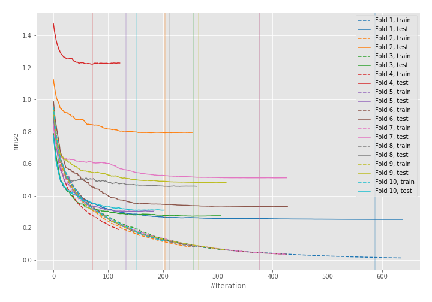
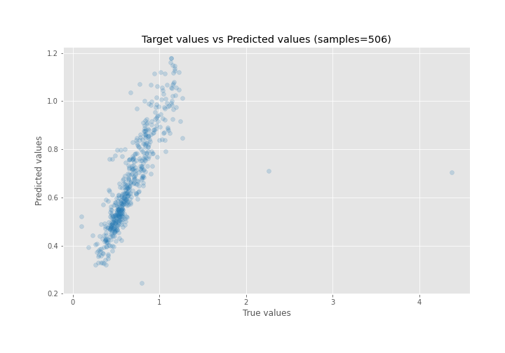
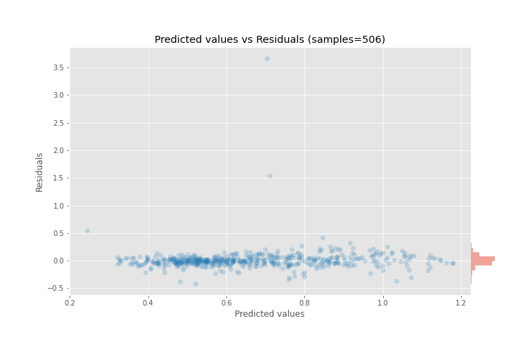

# Summary of 32_CatBoost

[<< Go back](../README.md)

## CatBoost
- **n_jobs**: -1
- **learning_rate**: 0.1
- **depth**: 7
- **rsm**: 1.0
- **loss_function**: RMSE
- **eval_metric**: RMSE
- **explain_level**: 0

## Validation
 - **validation_type**: kfold
 - **shuffle**: True
 - **k_folds**: 10

## Optimized metric
rmse

## Training time

5.9 seconds

### Metric details:
| Metric   |     Score |
|:---------|----------:|
| MAE      | 0.0782096 |
| MSE      | 0.0407117 |
| RMSE     | 0.201771  |
| R2       | 0.516504  |
| MAPE     | 0.125011  |

## Learning curves

## True vs Predicted

## Predicted vs Residuals

[<< Go back](../README.md)
