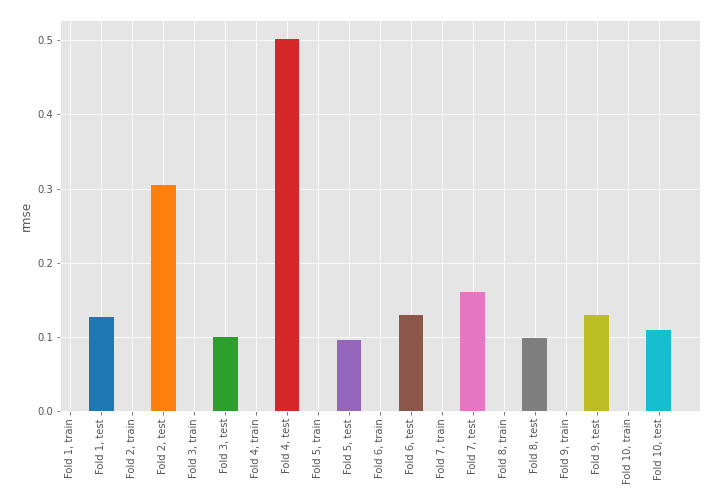
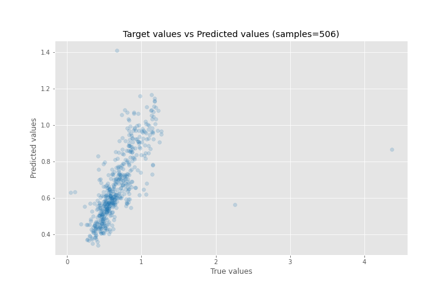
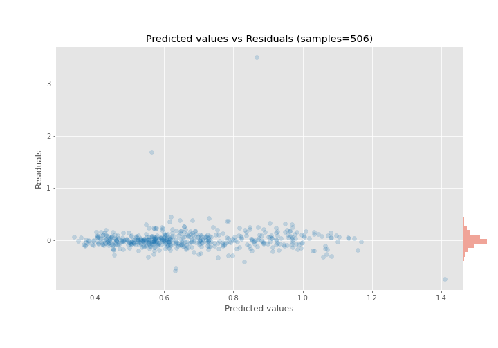

# Summary of 67_NearestNeighbors

[<< Go back](../README.md)

## k-Nearest Neighbors (Nearest Neighbors)
- **n_jobs**: -1
- **n_neighbors**: 7
- **weights**: distance
- **explain_level**: 0

## Validation
 - **validation_type**: kfold
 - **shuffle**: True
 - **k_folds**: 10

## Optimized metric
rmse

## Training time

3.2 seconds

### Metric details:
| Metric   |     Score |
|:---------|----------:|
| MAE      | 0.101408  |
| MSE      | 0.0463559 |
| RMSE     | 0.215304  |
| R2       | 0.45032   |
| MAPE     | 0.18053   |

## Learning curves

## True vs Predicted

## Predicted vs Residuals

[<< Go back](../README.md)
