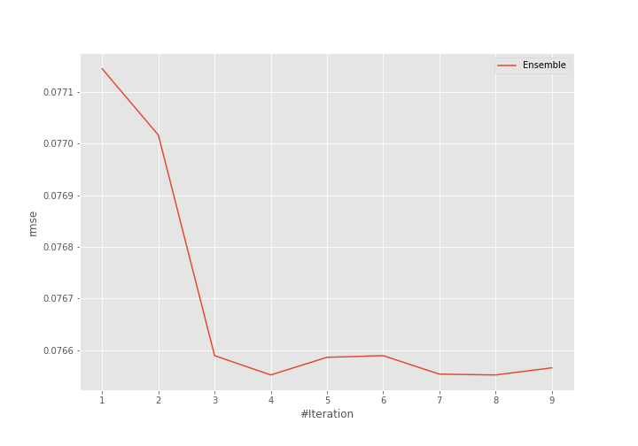
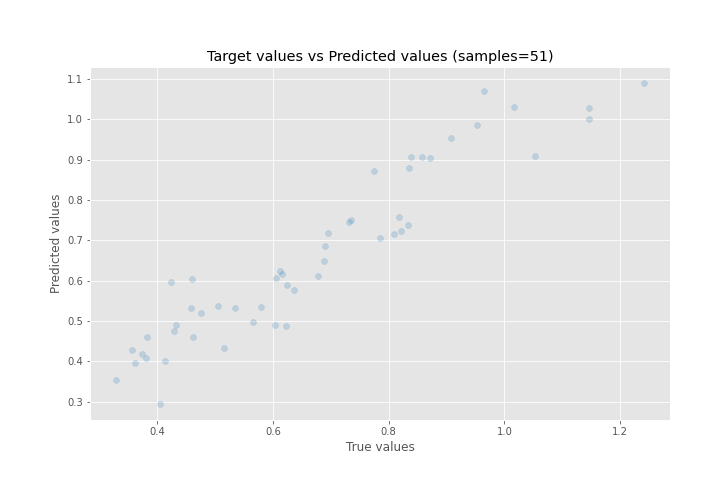
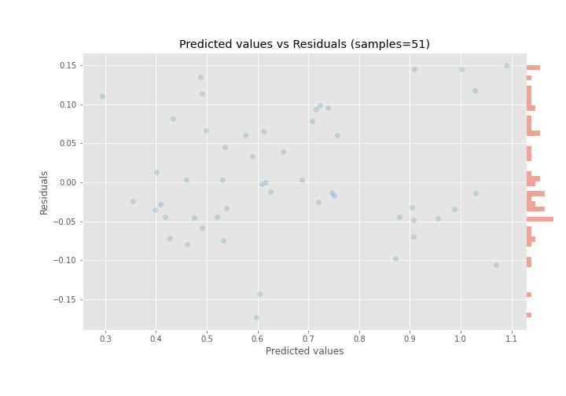

# Summary of Ensemble

[<< Go back](../README.md)

## Ensemble structure
| Model                      |   Weight |
|:---------------------------|---------:|
| 14_LightGBM                |        3 |
| 14_LightGBM_GoldenFeatures |        1 |

### Metric details:
| Metric   |      Score |
|:---------|-----------:|
| MAE      | 0.0621731  |
| MSE      | 0.00586027 |
| RMSE     | 0.0765524  |
| R2       | 0.888297   |
| MAPE     | 0.100094   |

## Learning curves

## True vs Predicted

## Predicted vs Residuals

[<< Go back](../README.md)
