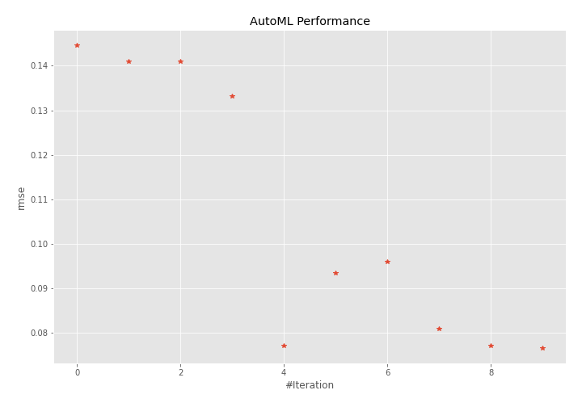
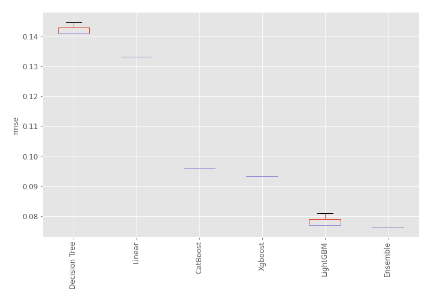
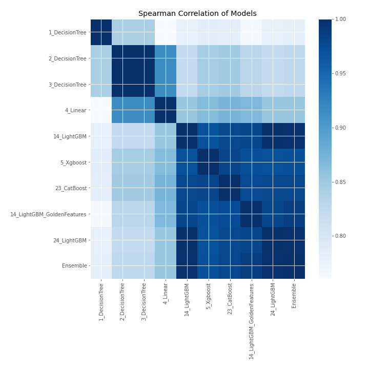

# AutoML Leaderboard

| Best model   | name                                                               | model_type    | metric_type   |   metric_value |   train_time |
|:-------------|:-------------------------------------------------------------------|:--------------|:--------------|---------------:|-------------:|
|              | [1_DecisionTree](1_DecisionTree/README.md)                         | Decision Tree | rmse          |      0.144646  |         0.76 |
|              | [2_DecisionTree](2_DecisionTree/README.md)                         | Decision Tree | rmse          |      0.140926  |         0.55 |
|              | [3_DecisionTree](3_DecisionTree/README.md)                         | Decision Tree | rmse          |      0.140926  |         0.56 |
|              | [4_Linear](4_Linear/README.md)                                     | Linear        | rmse          |      0.133148  |         0.59 |
|              | [14_LightGBM](14_LightGBM/README.md)                               | LightGBM      | rmse          |      0.0771442 |         0.76 |
|              | [5_Xgboost](5_Xgboost/README.md)                                   | Xgboost       | rmse          |      0.0934645 |         0.71 |
|              | [23_CatBoost](23_CatBoost/README.md)                               | CatBoost      | rmse          |      0.0960116 |         1.19 |
|              | [14_LightGBM_GoldenFeatures](14_LightGBM_GoldenFeatures/README.md) | LightGBM      | rmse          |      0.0809958 |         2.49 |
|              | [24_LightGBM](24_LightGBM/README.md)                               | LightGBM      | rmse          |      0.0771442 |         0.86 |
| **the best** | [Ensemble](Ensemble/README.md)                                     | Ensemble      | rmse          |      0.0765524 |         0.24 |

### AutoML Performance

### AutoML Performance Boxplot

### Spearman Correlation of Models

