## Bivariate analysis of District feature with target

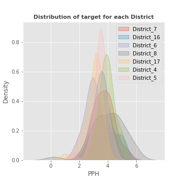

------------------------------------------------------
## Bivariate analysis of Area feature with target

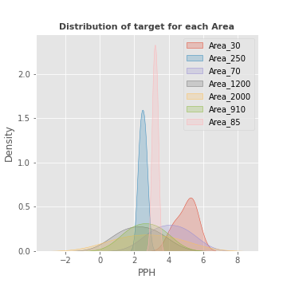

------------------------------------------------------
## Bivariate analysis of Year feature with target

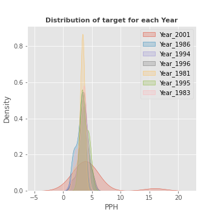

------------------------------------------------------
## Bivariate analysis of Max_Temp feature with target

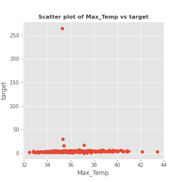

------------------------------------------------------
## Bivariate analysis of Min_Temp feature with target

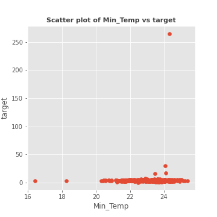

------------------------------------------------------
## Bivariate analysis of Rainfall feature with target

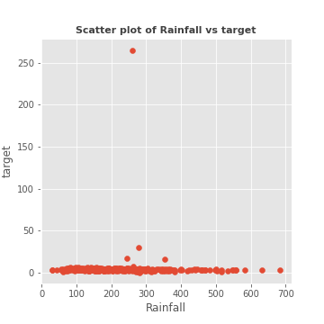

------------------------------------------------------
## Bivariate analysis of Humidity feature with target

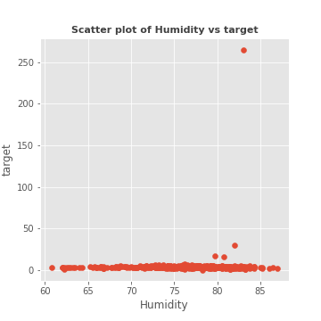

------------------------------------------------------
## Bivariate analysis of Wind feature with target

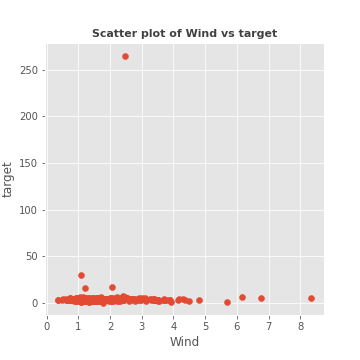

------------------------------------------------------
## Bivariate analysis of Cloud feature with target

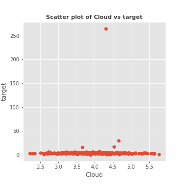

------------------------------------------------------
## Bivariate analysis of Sunshine feature with target

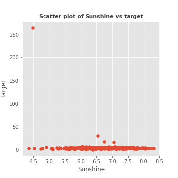

------------------------------------------------------
## Bivariate analysis of ALT feature with target

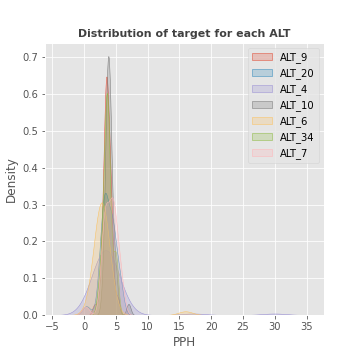

------------------------------------------------------
## Bivariate analysis of Productions feature with target

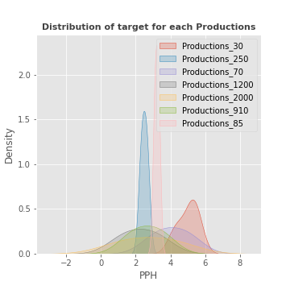

------------------------------------------------------
## Heatmap
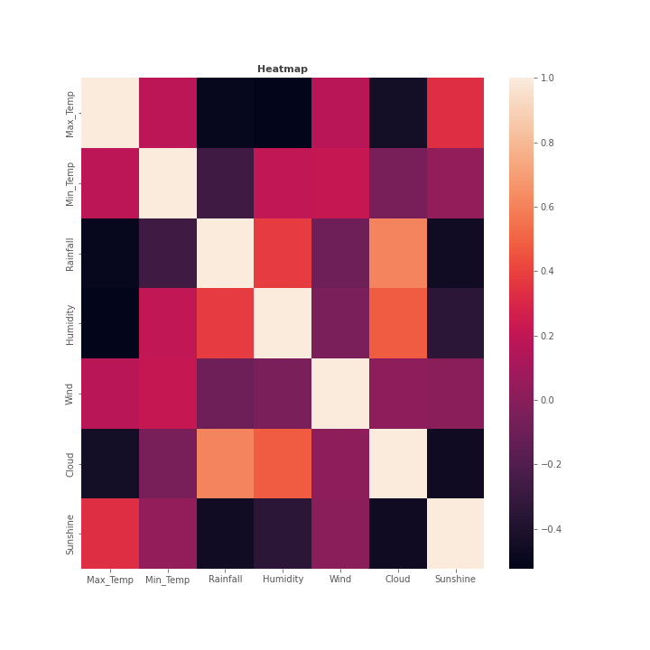

------------------------------------------------------
